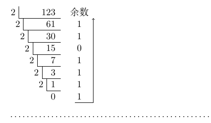

# 2.1 数制与编码

## 2.1.1 进位计数制与相互转换

### 1、进位计数法

**基数**：每个数位所要用到的不同符号的个数（二进制就是2个、8进制就是8个、十进制就是10个...）。

基数越大，**位数**越小，运算情况越多。

位权：依据进制所决定的一个常数（二级制就是2，十进制就是10...）

一个**r进制**数的数值可以表示为：

$$
\sum_{i=n}^{-m}K_{i}r^{i}=K_{n}r^{n} +K_{n-1}r^{n-1}...+K_{0}r^{0}+K_{-1}r^{-1}+ ...+K_{-m}r^{-m}
$$

* r：基数
* $$r^{i}$$ ：第i位的位权
* $$K_{i}$$ ：可以取0~（r-1）中的任意数
* 整数最低位为第0位，小数为负数位

### 2、进制转换

#### （一）、任意进制 --&gt; 十进制

用相应位上的数乘以位权即可。

> 二进制：101.1 --&gt; $$1*2^{2} + 0*2^{1} + 1 * 2^{0} + 1 *2^{-1} = 5.5$$ 
>
> 八进制：5.4 --&gt; $$5*8^{0} + 4* 8^{-1} = 5.5$$ 
>
> 十六进制：5.8 --&gt; $$5 * 16^{0} + 8 *  16 ^{-1} = 5.5$$

#### （二）、十进制 --&gt; 任意进制

例：将十进制123.6875转化为二进制

#### 1、除基取余法（整数）

对整数部分的处理使用短除法，并从下向上，得1111011

#### 2、乘基取整法（小数）

$$
\begin{array}{r}
10010101B\\
+01001010B\\
\hline
11011111
B
\end{array}
$$

