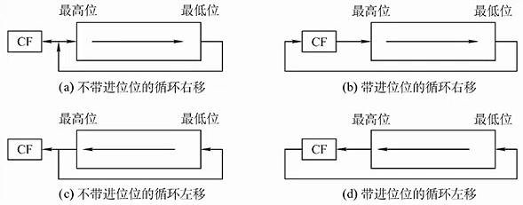
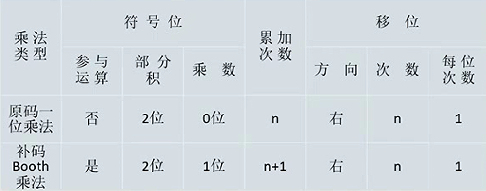

# 2.2 定点数的表示与运算

## 2.2.1 定点数的表示

### 1、无符号数和有符号数

**无符号数**：整个机器字长的全部二进制位均为数值位，没有符号位，相当于数的**绝对值**。

n位无符号数的表示范围是 $$0 \sim  2^{n}-1$$ 

#### 有符号数

* **真值**：该数字的实际值，包含正负；
* **机器数**：用数字表示正负号的二进制数
* **定点小数**：约定符号位后面就是小数点
  * \+0.75D = 0.11B
  * \-0.75D =1.11B
  * n位尾数的定点小数的表示范围： $$-(1- 2^{-n}) \sim  (1- 2^{-n})$$
* **定点整数**：约定小数点在数值的最后
  * \+3D = 011.B
  * \-3D = 111.B
  * n位尾数的定点整数的表示范围：$$-(2^{-n}-1) \sim  (2^{-n}-1)$$

### 2、原码、补码、反码、移码


整数的“，”和小数的“.”都是用于表示分割，在计算机中实际不存在


#### （1）原码

**用最高位表示符号位**，设 x 为真值，则有：

纯小数的原码： 

$$
[x]_{\text {原 }}= \begin{cases}x & 1>x \geqslant 0 \\ 1-x=1+|x| & 0 \geqslant x>-1\end{cases}
$$

纯整数的原码（n为整数位数）：

$$
[x]_{\text {原 }}= \begin{cases}0, x & 2^{n}>x \geqslant 0 \\ 2^{n}-x=2^{n}+|x| & 0 \geqslant x>-2^{n}\end{cases}
$$

#### （2）补码

* 正数的补码：补码与原码相同
* 负数的补码：原码符号位不变，数值位取反，末位加1
* 当一个正数和一个负数互为补数时，他们的绝对值之和称为**模数**。
  * 类似于时钟，+2 = -10，12为模数
* $[+0]_补=[-0]_补=0.0000$

纯小数的补码：

$$
[x]_{\text {补}}=\left\{\begin{array}{ll}
 x & 1>x \geqslant 0 \\2+x=2-|x| & 0 > x \geqslant-1
\end{array} \quad\left(\bmod 2\right)\right.
$$

纯整数的补码

$$
[x]_{\text {补}}=\left\{\begin{array}{ll}
0, x & 2^{n}>x \geqslant 0 \\
2^{n+1}+x=2^{n+1}-|x| & 0 \geqslant x \geqslant-2^{n}
\end{array} \quad\left(\bmod 2^{\mathrm{n}+1}\right)\right.
$$

#### （3）反码

* 正数的反码：反码与原码相同
* 负数的反码：原码符号位不变，数值位取反

#### （4）移码

移码就是在真值X上加上一个常数(偏置值)  ，通常这个常数取 $$2^{n}$$ 。

> 例： $$x_{1}=+10101$$，$$x_{2}=-10101$$，字长为8位，则其移码表示为:
>
> $$\begin{align} [x_{1}]_{移} &= 2^{7} + 10101\\&=10000000+10101 \\&= 1,0010101 \end{align}$$ $$\begin{align} [x_{2}]_{移} &= 2^{7} + (-10101)\\&=10000000+(-10101) \\&= 0,1101011 \end{align}$$ 

- 同一个数，补码和移码**只有符号位相反**
- 移码大真值就大，移码小真值就小
  - 移码全为0：$-2^n$
  - 移码全为1：$2^n-1$
- 移码的0唯一

## 2.2.2 定点数的运算

### 1、定点数的移位运算

对于r进制而言：

* 右移n位： $$\div r^{n}$$ 
* 左移n位： $$\times r^{n}$$ 

可以与加减法结合实现乘除法。

#### （1）算术移位

机器码采用有符号数，符号位不参与

* 正数
  * 空位补0
* 负数
  * 原码：0
  * 补码：
    * 左移：0
    * 右移：1
  * 反码：1

#### （2）逻辑移位

机器码采用**无符号数**，直接补0。

#### （3）循环移位

### 2、加减法

补码直接相加即可

> 例：设机器字长为8位（含一位符号位），A=15，B=-24，求 $$[A+B]_{补}$$ 和$$[A-B]_{补}$$
>
> 先求原码：
>
> $$A = +1111 = 0,1111 = 0, 0001111\\ B= -11000 = 1,11000 = 1, 0011000$$ 
>
> 则可得补码：
>
> $$A = 0,0001111\\ B = 1, 1101000$$ 
>
> 另外 $$[-B]_{补}: [B]_{补}$$ 连同符号位一起取反再+1
>
> 可得结果：
>
> $$[A+B]_{补} = [A]_{补} + [B]_{补} = 0,0001111+1,1101000 = 1,1110111\\ [A-B]_{补} = [A]_{补} + [-B]_{补} = 0,0001111+0,0011000 = 0,0100111$$ 

### 3、溢出的概念和判断方式

* 大于机器所能表示的最大正数称为**上溢**；
* 小于机器所能表示的最小负数称为**下溢**。
* 当两个符号**相同**的数**相加**或者两个符号**相异**的数**相减**时才会发生溢出。

对溢出的判断有几种方式：

#### （一）采用一位符号位

设A的符号位为 $$A_{S}$$ ，B的符号位为$$B_{S}$$，运算结果的符号位为$$S_{S}$$，则溢出的逻辑表达式为：

$$
V=A_{\mathrm{S}} B_{\mathrm{S}} \overline{S_{\mathrm{S}}}+\overline{A_{\mathrm{S}}} \overline{B_{\mathrm{S}}} S_{\mathrm{S}}
$$

* 若V=0，则无溢出
* 若V=1，则发生了溢出

#### （二）采用一位符号位根据数据位进位情况判断溢出

设符号位的进位 $$C_{S}$$ ，最高数位的进位$$C_{1}$$，则当$$C_{S}$$和$$C_{1}$$不同时发生溢出。

#### （三）采用双符号位

正数符号位为00，负数符号位为11。

记两个符号位分别为$$S_{S1}$$和$$S_{S2}$$，则 $$V=S_{S1} \oplus S_{S2}$$ ，若V=0，无溢出；V=1，有溢出。

### 4、定点数的乘法运算

#### （一）原码一位乘法

> 例：机器字长5位（含一位符号位），$[x]_原$=1.1101，$[y]_原$=0.1011，采用原码一位乘法求x*y
>
> - 符号位单独处理：1$\oplus$0=1
> - 绝对值相乘
>   - $[|x|]_原$=0.1101，$[|y|]_原$=0.1011
>   - ACC存放乘积高位，MQ存放乘数、乘积低位，X存放被乘数
>   - ACC置0，MQ=01011，X=01101
>   - MQ中最低一位
>     - 为1，ACC加上被乘数
>     - 为0，ACC加上0
>   - 1，ACC=00000+01101=01101
>   - ACC与MQ统一右移一位，高位补0：ACC=00110，MQ=1010<mark style="color:blue;">**1**</mark>
>   - 1，ACC=00110+01101=10011
>   - ACC=01001，MQ=11010
>   - 0，ACC=01001
>   - ACC=00100，MQ=11101
>   - 1，ACC=00100+01101=10001
>   - ACC=01000，MQ=11110，MQ此时仅剩最后一位，为原符号位，不参与运算
>   - 小数点位置固定在ACC原符号位后，结果：0.10001111
> - 修改符号位：1.10001111

#### （二）补码一位乘法

### 5、定点数除法运算

详见P44

## 2.2.3 整数型及类型转换

长整数变为短整数：0x000286a1 --> 0x86a1（数据进行截断）

有符号数变为无符号数：0xef1f（真值-3421） --> 0xef1f（真值61215）

