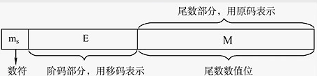

# 2.3 浮点数的表示和运算

## 2.3.1 浮点数的表示

### 1、浮点数的表示

浮点数通常表示为：

$$
N = r^{E}  \times M
$$

* r：阶码的底，通常为2
* E：**阶码**，反映浮点数的表示范围和小数点的实际位置，用**补码或移码**表示
* M：**尾数**，其位数反映了小数的精度，用**原码或补码**表示

> 例：阶码和尾数都用补码表示，求a、b的真值
>
> * a = 0,01; 1.1001
> * b = 0,01; 0.01001
>
> a：
>
> * 阶码0,01对应真值+1
> * 尾数0.1001对应真值-0.0111，也可看作-111右移四位： $$- \frac{7}{2^{4}}$$ 
> * 故 $$a = 2^{1} \times (-\frac{7}{2^{4}}) = - \frac{7}{8}$$ 
>
> b：
>
> * 阶码对应真值+1
> * 尾数0.01001对应真值+0.01001，也可看作+1001右移五位： $$+\frac{9}{2^{5}}$$ 
> * 故 $$b= 2^{1} \times \frac{9}{2^{5}} = \frac{9}{16}$$

### 2、浮点数的规格化

规定尾数的最高位必须是一个有效值。

**左规**：当浮点数运算的结果为非规格化时要进行规格化处理，将尾数左移一位，阶码减1 \( 基数为2时\)。 

> 001; 00100\(1\)= $$2^{1} \times (+0.01001)$$ --&gt; $$2^{0} \times (+0.10010)$$ = 000; 01001\(0\)

**右规**：当浮点数运算的结果尾数出现溢出\(双符号位为01或10\)时，将尾数右移一位，阶码加1 \(基数为2时\)。

> 例：a=010; 00.1100；b = 010; 00.1000，求a+b
>
> $$a=2^{2}\times 00.1100\quad b=2^2\times00.1000\\ \begin{align}  a+b &= 2^{2} \times (00.1100 + 00.1000)\\ &= 2^{2} \times 01.0100\quad(\text{发生溢出})\\ &= 2^{3} \times 00.1010 \end{align}$$

规格化后的尾数满足： $$\frac{1}{r} \leq |M| \leq 1$$ 

### 3、IEEE 754 标准

| 类型 | 数阶 | 阶码 | 尾数数值 | 总位数 | 偏置值 |
| :---: | :---: | :---: | :---: | :---: | :---: |
| 短浮点数 | 1 | 8 | 23 | 32 | 7FH（127） |
| 长浮点数 | 1 | 11 | 52 | 64 | 3FFH（1023） |
| 临时浮点数 | 1 | 15 | 64 | 80 | 3FFFH |

* 规格化的短浮点数的真值为：$$(-1)^{S}\times 1.M \times 2^{E-127}$$ ；
* 规格化的长浮点数的真值为：$$(-1)^{S}\times 1.M \times 2^{E-1023}$$。

一些其他标准：

* $$E = 0$$且$$M = 0$$，则真值为0；
* $$E = 0$$且$$M \neq 0$$ ，为非规格化数，真值 $$= (-1)^{S} \times 0.M \times 2^{-126}$$ ；
* $$1 \leq E \leq 254$$ 时，真值$$= (-1)^{S} \times 1.M \times 2^{E-127}$$（正常的值）；
* $$E = 255$$且$$M \neq 0$$，真值为‘NaN’（非数值）；
* $$E = 255$$且$$M =0$$，真值为正或负无穷。 

## 2.3.2 浮点数的运算

### 1、加减运算

**步骤**：

1. 对阶
2. 尾数加减
3. 规格化
4. 舍入
5. 判溢出

> 例：已知十进制数$$X=-\frac{5}{256}$$、$$Y=+\frac{59}{1024}$$，按机器补码浮点运算规则计算X-Y，结果用二进制表示，浮点数格式如下：阶符取2位，阶码取3位，数符取2位，尾数取9位
>
> $$5D=101B,\frac{1}{256}=2^{-8}\\ \begin{align}  X&=-101\times2^{-8}\\ &=-0.101\times2^{-5D} \\ &=-0.101\times2^{-101} \end{align}$$ 
>
> * 阶码
>   * -101，补码为：1011
>   * 阶符取两位、阶码取三位：11011
> * 尾数
>   * -0.101，补码为1.011
>   * 数符取两位，尾数取九位：11.011000000
> * 可得X：11011；11.011000000
>
> 同理：$$59D=111011B,\frac{1}{1024}=2^{-10}\\ \begin{align}  Y&=+111011\times2^{-10}\\ &=+0.111011\times2^{-4D} \\ &=+0.111011\times2^{-100} \end{align}$$
>
> * 阶码
>   * -100，补码为1100
>   * 阶符取两位、阶码取三位：11100
> * 尾数
>   * +0.111011，补码为0.111011
>   * 数符取两位，尾数取九位：00.111011000

