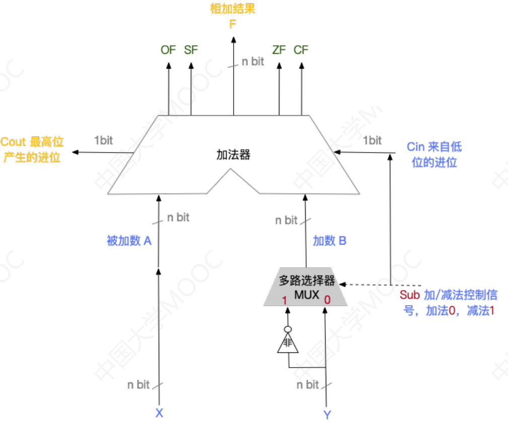

# 2.4 算数逻辑单元（ALU）

* 算数运算：加、减、乘、除等
* 逻辑运算：与、或、非、异或等
* 辅助功能：移位、求补等

接收输入信号，再接收控制信号，根据控制信号得到相应的输出信号。

## 2.4.1 串行加法器和并行加法器

### 1、一位全加器

* A、B：输入
* $$C_{i-1}$$ ：前一级的进位信息
* $$S_{i}$$：输出结果
* $$C_{i}$$：输出进位信息

和表达式： $$S_{i}=A_{i} \oplus B_{i} \oplus C_{i}$$ 

进位表达式： $$C_{i}=A_{i} \cdot B_{i} +(A_{i}\oplus B_{i})\cdot C_{i-1}$$ 

### 2、串行加法器

只有一个全加器，数据逐位依次串行输入，用进位寄存器存储进位信号。

### 3、并行加法器

#### （1）串行进位的并行加法器

把n个全加器串接起来，就可进行两个n位数的相加。

#### （2）并行进位的并行加法器

并行加法器的进位表达式： $$C_{i} = G_{i}+P_{i}C_{i-1}$$ ，其中：

* $$G_{i}=A_{i}\cdot B_{i}$$：进位产生函数
* $$P_{i} = A_{i}\oplus B_{i}$$：进位传递函数

通过递推可知，所有位的 $$C_{i}$$ 都可以仅由 $$G_{i}$$，$$P_{i}$$ 和 $$C_{0}$$ 得到。

#### 1、单级先行进位方式（组内并行、组间串行）

#### 2、多级先行进位方式（组内并行、组间并行）

## 2.4.3 补码加/减法运算器

### 1、加法器原理

> 例1：A=1000，B=0111，Cin=0
>
> 则：F=1111，Cout=0
>
> 例2：A=1000，B=0111，Cin=1
>
> 则：F=0000，Cout=1

### 2、补码加减器


**补码加减法原理**：

X+Y：直接按位相加

X-Y：

1. Y全部按位取反，末位+1
2. 减法变加法



**Sub信号的作用**

- 控制多路选择器的输出
- 若计算减法时，1同时输入到Cin，用作补码取反后的+1

> 例：4bit补码，X=-8，Y=7
>
> $\text{X}_{补} = 1000$，$\text{Y}_{补} = 0111$
>
> X+Y：直接输出：1111B（补）=-1D
>
> X-Y：1000+（1000+1）=0001B（补）（产生溢出）

**这一电路同样适用于无符号数的加减法**，原理完全一致

## 2.4.2 标志位

- 有符号数
  - OF：溢出标志位
    - 最高位产生的进位与次高位产生的进位异或
    - <mark style="color:orange;">**判断有符号数的溢出**</mark>
  - SF：符号标志位
    - 取运算结果的最高位

> 例：4bit补码，X=-8，Y=7
>
> $\text{X}_{补} = 1000$，$\text{Y}_{补} = 0111$
>
> - X+Y
>   - 直接输出：1111B（补）=-1D
>   - OF=0$\oplus$0=0：没有溢出
>   - SF=1：结果是负数
>
> - X-Y
>   - 1000+(1000+1)=0001B
>   - OF=1$\oplus$0=1：产生了溢出
>   - SF=0：结果是正数

- 无符号数
  - ZF：零标志位
    - 运算结果全部为零
  - CF：进位标志
    - 最高位的进位信号与sub进行异或
    - 为1代表发生了借位，产生溢出
    - <mark style="color:orange;">**判断无符号数的溢出**</mark>

> 例：4bit原码，无符号数X=3，Y=4
>
> X=0011B，Y=0100B
>
> - X+Y
>   - 直接输出：0111B（原）=7D
>   - ZF：0
>   - CF：0$\oplus$0=0
> - X-Y
>   - 0011+(1011+1)=1111B（原）
>   - ZF：0
>   - CF：0$\oplus$1=1（产生了借位溢出）
