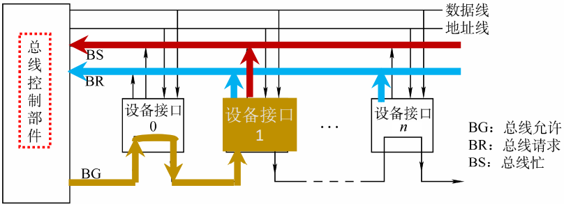
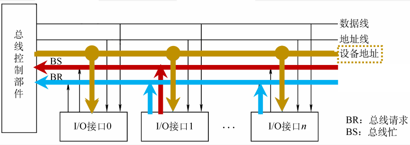
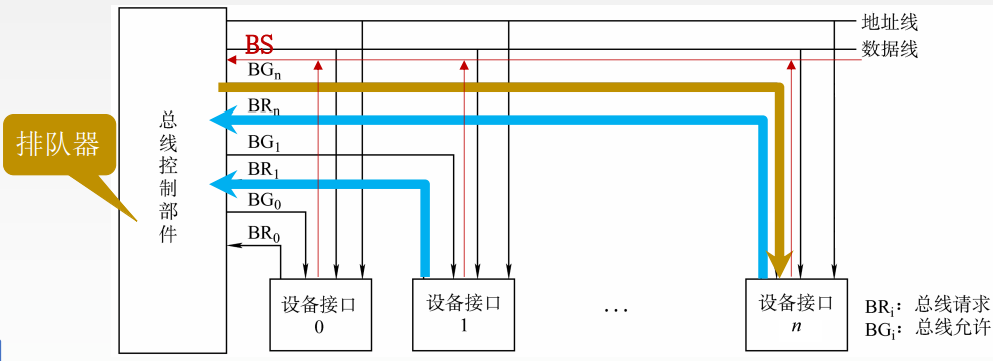

# 6.2 总线仲裁

用于处理多个设备争抢总线控制权的问题

## 6.2.1 集中仲裁方式

1. 主设备发出请求信号
2. 若多个主设备同时要使用总线，则由<mark style="color:purple;">**总线控制器**</mark>的判优、仲裁逻辑按一定的优先等级顺序确定哪个主设备能使用总线
3. 获得总线使用权的主设备开始传送数据
3. <mark style="color:orange;">**由获得总线使用权的设备发出总线忙（BS）信号**</mark>

### 1、 链式查询方式

总线允许信号按照顺访问各个设备

- 优点
  - 优先级固定：离总线控制器越近的部件，优先级越高
  - 只需要三根控制线，结构简单，扩充容易
- 缺点
  - 对硬件电路的故障敏感
  - 优先级不能改变
  - 会产生“饥饿”现象

### 2、计数器查询方式

1. 总线控制器收到总线请求信号，判断总线空闲，计数器开始计数

2. 总线计数器从初始值开始增加，并通过地址线发送出去

3. 当地址线上的计数值与请求使用总线的设备一致时，停止计数，分配总线

   

- 优点
  - 通过改变计数器初始值可以<mark style="color:orange;">**改变优先级**</mark>
  - 对电路的故障没有链式的敏感
- 缺点
  - 控制线数量增加
    - 地址线数量：若有n个设备，则需要$$\log_{2}n$$条地址线
  - 控制相对比链式查询相对复杂

### 3、独立请求方式

- 每个设备有单独的总线允许和总线请求线与总线控制器相连
- 总线控制器通过总线忙信号来判明当前是否有设备占用总线
- 总线控制器中的<mark style="color:purple;">**排队器**</mark>来决定设备使用总线资源的顺序

- 优点
  - **响应速度快**，总线允许信号BG直接从控制器发送到有关设备，不必在设备间传递或者查询
  - 对优先次序的控制相当灵活
- 缺点
  - **控制线数量多**，若设备有n个，则需要2n+1条控制线
  - 总线的控制逻辑更加复杂

## 6.2.2 分布式总裁方式

不需要中央仲裁器，每个潜在的主模块都有自己的仲裁器和<mark style="color:purple;">**仲裁号**</mark>（表示优先级），多个仲裁器竞争使用总线

1. 当设备有总线请求时，它们就把各自唯一的仲裁号发送到共享的仲裁总线上
2. 每个仲裁器将从仲裁总线上得到的仲裁号与自己的仲裁号进行比较
   - 如果仲裁总线上的号优先级高，则它的总线请求不予响应，并撤销它的仲裁号
3. 最后，获胜者的仲裁号保留在仲裁总线上
