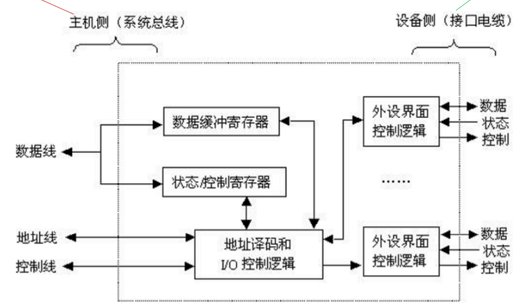

# 7.3 I/O接口

## 7.3.1 I/O接口的功能

- **数据缓冲**：通过<mark style="color:purple;">**数据缓冲寄存器**</mark>（DBR）达到主机和外设工作速度的匹配
- **错误或状态监测**：通过<mark style="color:purple;">**状态寄存器**</mark>反馈设备的各种错误、状态信息，供CPU查用
- **控制和定时**：接收从控制总线发来的控制信号、时钟信号
- **数据格式转换**：串-并、并-串等格式转换
- **与主机和设备通信**：实现主机——I/0接口——I/O设备之间的通信

## 7.3.2 I/O接口的基本结构

有的I/O接口可以接多个设备

### 1、I/O接口的工作原理

1. 发命令：发送命令字到<mark style="color:purple;">**I/O控制寄存器**</mark>，向设备发送命令
2. 读状态：从<mark style="color:purple;">**状态寄存器**</mark>读取状态字，获得设备或I/O控制器的状态信息
3. 读/写数据：从<mark style="color:purple;">**数据缓冲寄存器**</mark>发送或读取数据，完成主机与外设的数据交换



控制寄存器、状态寄存器在使用时间上是<mark style="color:orange;">**错开的**</mark>，因此有的I/O接口中可将二者合二为一



### 2、I/O接口的内部接口

**内部接口**：内部接口与系统总线相连，实质上是与内存、CPU相连

**外部接口**：外部接口通过接口电缆与外设相连

- **数据线**
  - 读写数据
  - 状态字
  - 命令字（控制字）
  - 中断类型号
- **地址线**
  - I/O端口
- **控制线**
  - 读/写IO端口的信号
  - 中断请求信号
