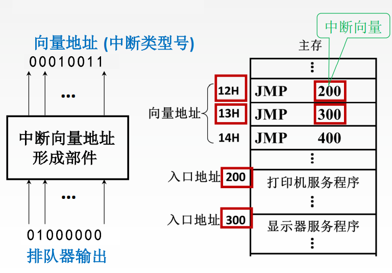
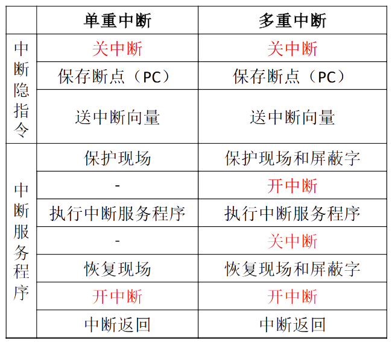
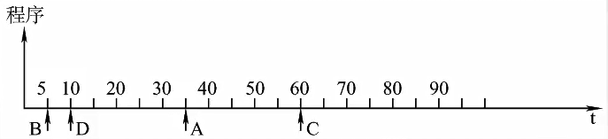
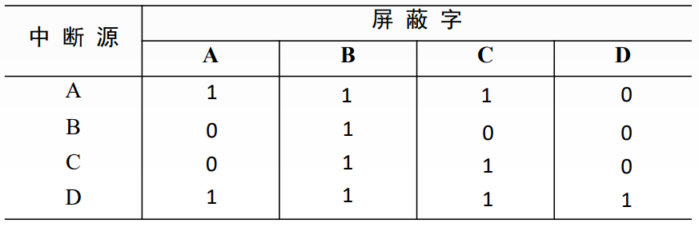
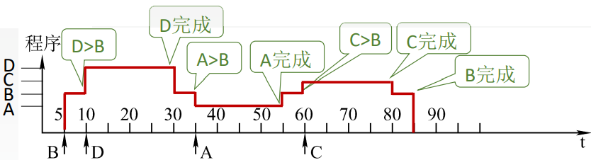
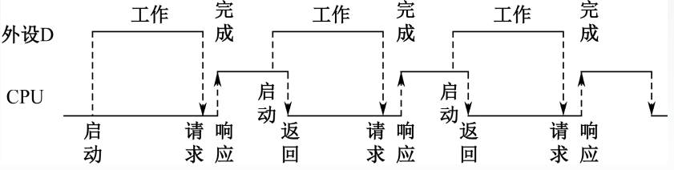

# 7.4 I/O方式

## 7.4.1 程序查询方式

```assembly
IN Rd,Rs #把IO端口Rs的数据输入到CPU寄存器Rd
OUT Rd,Rs #把CPU寄存器Rs的数据输出到IO端口Rd
```

### 1、一次工作的流程

1. CPU执行<mark style="color:orange;">**初始化**</mark>程序，并预置传送参数
   - 设置计数器
   - 设置数据首地址
2. 向I/O接口发送命令字，<mark style="color:orange;">**启动I/O设备**</mark>
3. CPU从接口读取设备状态信息
   - CPU不断查询I/O设备状态，直到外设准备就绪
4. 传送一次数据，一般为一个字
5. 修改参数
   - 修改地址
   - 修改计数器
6. 判断传送是否结束，未结束则继续传输

### 2、程序查询方式的优缺点

- 优点
  - 接口设计简单
  - 设备量少
- 缺点
  - CPU在信息传送过程中要花费很多时间用于查询和等待
  - CPU在一段时间内只能和一台外设交换信息
  - 效率低

## 7.4.2 程序中断方式

### 1、中断的基本概念

CPU在每一个指令的末尾会检测是否存在中断

检测到中断时，会进行断点保存，并在中断处理结束后从断点恢复程序

I/O设备的中断属于<mark style="color:purple;">**外中断**</mark>，且是<mark style="color:purple;">**可屏蔽中断**</mark>

### 2、中断的工作流程

#### （1）中断请求

中断源向CPU发出中断请求

CPU根据<mark style="color:purple;">**中断标志位**</mark>判断中断来自谁

#### （2）中断判优

可以通过硬件（排队器）或是软件（查询程序）来实现

一来来说，判优要遵循如下原则

- 硬件故障中断属于最高级，其次是软件中断
- 非屏蔽中断优于可屏蔽中断
- DMA请求优于I/O设备传送的中断请求
- 高速设备优于低速设备
- 输入设备优于输出设备
- 实时设备优于普通设备

#### （3）CPU响应中断的条件

- 中断源有中断请求
- 当前CPU处于开中断状态
- 一条指令已经执行完毕

#### （4）中断隐指令

**中断隐指令**：保存原程序的PC值，并让PC指向中断服务程序的第一条指令。是一系列的指令。

1. **关中断**：保证接下来保存断点的操作不被打断
2. **保存断点**：将当前PC的值保存
3. **引出中断服务程序**：将PC的值修改为中断服务程序的入口
   - 硬件向量法
     - 根据排队器的输出确定中断来源
     - 每一个中断对应一个中断向量地址
     - 依据<mark style="color:purple;">**向量地址**</mark>在主存中找到对应的存储单元
     - 根据存储单元中的<mark style="color:purple;">**中断向量**</mark>（JUMP）找到中断服务程序入口
   - 软件查询法



#### （5）中断服务程序

1. **保护现场**：保存通用寄存器和状态寄存器的内容
2. **中断服务**
3. **恢复现场**：通过出栈指令或取数指令把之前保存的信息送回寄存器中
4. **中断返回**：弹出栈顶存储的程序断点信息（原PC值），返回到原程序的断点处
5. **开中断**

### 3、多重中断

**单重中断**：执行中断服务程序时不响应新的中断请求

**多重中断**：又称中断嵌套，执行中断服务程序时可响应新的中断请求



#### 中断屏蔽技术

- 每一个中断源对应一个<mark style="color:purple;">**屏蔽字**</mark>
- 屏蔽字表明处理该中断时屏蔽那些中断
- 屏蔽字是一连串bit，一般1表示屏蔽、0表示允许
- 屏蔽字中1越多，中断优先级越高
- 每个屏蔽字中至少需要一个1（屏蔽自己）



例：设某机有4个中断源A、B、C、D，其硬件排队优先次序为A>B>C>D，现要求将中断处理次序改为D>A>C>B。

1）写出每个中断源对应的屏蔽字。

2）按下图所示的时间轴给出的4个中断源的请求时刻，画出CPU执行程序的轨迹。设每个中断源的中断服务程序时间均为20us



（1）优先级高的屏蔽优先级低的+屏蔽自己



- A的屏蔽字：1110
- B的屏蔽字：0100
- C的屏蔽字：0110
- D的屏蔽字：1111

（2）





### 4、程序中断方式



例：假定CPU主频为50MHz，CPI为4。设备D采用异步串行通信方式向主机传送7位ASCII字符，通信规程中有1位 奇校验位和1位停止位，从D接收启动命令到字符送入I/O端口需要0.5ms。设备D采用中断方式进行输入/输出，示意图如下



I/O端口每收到一个字符申请一次中断，中断响应需10个时钟周期，中断服务程序共有20条指令，其中第15条指令启动D工作。

（1）若CPU需从D读取1000个字符，则完成这一任务所需时间大约是多少个时钟周期？

（2）CPU用于完成这一任务的时间大约是多少个时钟周期？

（3）在中断响应阶段CPU进行了哪些操作？

解：（1）

主频为50MHz，则时钟周期=1/50MHz=20ns

从D启动到字符送入I/O端口需要的时钟周期=0.5ms/20ns=25000

传送一个字符需要的时钟周期=$$25000+10+15\times4=25070$$（CPI：每条指令包含的时钟周期）

传送1000个字符需要的时钟周期=$$25070\times1000=25070000(+5\times4)$$（是否加上最后的中断处理都行）

（2）

实际上CPU相关的时钟周期就是处理中断程序的部分，故

$$1000\times(10+20\times4)=9\times10^{4}$$

（3）

即中断隐指令的内容：

- 关中断
- 保存断点
- 引出中断程序



## 7.4.3 DMA方式

