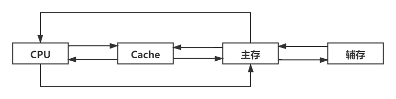

# 3.1 存储器概述

## 3.1.1 存储器的分类

### 1、按在计算机中的作用分类

* 主存储器
* 辅助存储器
* 高速缓冲存储器（Cache）

### 2、按照存储介质分

* 磁表面存储器
* 磁芯存储器
* 光存储器
* 半导体存储器

### 3、按存取方式分类

* 随机存储器（RAM）
* 只读存储器（ROM）：断电不丢失信息
* 串行访问存储器：需要先**物理**寻址
  * 顺序存取存储器：磁带
  * 直接存取存储器：磁盘

### 4、信息的可保存性

* 断电后存储信息是否消失
  * 易失性：RAM
  * 非易失性
* 读出时是否破坏信息
  * 破坏性读出：DRAM
  * 非破坏性读出

## 3.1.2 存储器的性能指标

* 存储容量
  * 存储容量 = 存储字数 X 字长（1M X 8位）
* 单位成本
  * $$每位价格 = \frac{总成本}{总容量}$$ 
* 存储速度
  * 存取时间
  * 存取周期
  * 主存带宽

## 3.2.1 多级存储结构

* Cache到主存：解决CPU与主存之间**速度**的矛盾
* 主存和辅存：解决主存**容量**的问题

从CPU→cache→主存→磁盘→磁带、光盘

* 速度越来越慢
* 容量越来越大
* 价格越来越低

