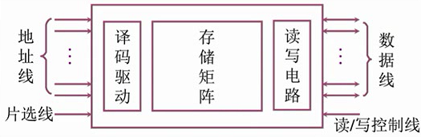

# 3.3 半导体随机存储器

## 3.3.1 SRAM和DRAM

### 1、半导体存储芯片的结构

* **存储矩阵**：由大量相同的位存储单元阵列构成
* **译码驱动**：将来自地址总线的地址信号翻译成对应存储单元的选通信号， 该信号在读写电路的配合下完成对被选中单元的读/写操作
* **读写电路**：包括读出放大器和写入电路，用来完成读/写操作
* **地址线**：决定CPU访问存储矩阵的哪里，**单向**输入，位数取决于芯片的容量
* **数据线**：进行数据的读写，**双向**读写，位数取决于芯片能够读/写的位数
* **片选线**：用于确定哪一个存储芯片被选中，可以表示为
  * $$\overline{\text C \text S}$$：芯片选择，低电平有效
  * $$\overline{\text C \text E}$$：芯片使能，低电平有效
* 读写控制线：可以有一根，也可以有两根
  * 一根
    * $$\overline{\text W \text E}$$：低电平写有效，高电平读有效
  * 两根
    * $$\overline{\text O \text W}$$：允许读，低电平有效
    * $$\overline{\text W \text E}$$：允许写，低电平有效

芯片的容量由地址线和数据线一起决定：

$$
芯片的容量 = 2^{地址线根数} \times 数据线根数
$$

### 2、SRAM和DRAM的区别

|              特点              |   SRAM   |               DRAM              |
| :--------------------------: | :------: | :-----------------------------: |
|           存储信息（0、1）          | 触发器（双稳态） |             电容（充放电）             |
|             破坏性读出            |     非    |                是                |
|             需要刷新             |    不要    | 
需要（电容上的

电荷只能维持2ms）
 |
| 
送行列地址

（行地址，列地址）
 |   同时传送   |               分两次送              |
|             运行速度             |     块    |                慢                |
|              集成度             |     低    |                高                |
|              发热量             |     大    |                小                |
|             存储成本             |     高    |                低                |

### 3、DRAM的刷新

#### 1）刷新的频率：

一般为2ms

#### 2）每次刷新多少存储单元：

以行为单位，一次刷新一行


使用行列地址的目的：减少选通线


#### 3）如何刷新

通过硬件支持，读出一行的信息后重新写入，占用1个读/写周期

#### 4）何时刷新

假设DRAM内部结构排列成 128X128 的形式，读/写周期0.5μs

* **分散刷新**
  * 每读写一次就刷新该行
  * 前0.5μs用于读写、后0.5μs用于刷新
  * 系统的存取周期变为1μs
* **集中刷新**
  * 2ms内集中安排时间刷新
  * 例如最后128个周期（64μs）全部用于刷新128行
  * 用于刷新的存储周期内无法访问存储器，称为**访存死区**
* **异步刷新**
  * 将128次刷新平均分布在2ms内
  * 每15.6μs会有一个0.5μs的**死时间**

### 4、RAM的读写周期

#### SRAM的读周期

* $$t_{CO}$$之前：等待地址线稳定
* $$t_{CO}$$：片选保持时间
* 数据全部读出之后，在外部总线上稳定的出现，片选信号失效
* $$t_{A}$$：读出时间
* $$t_{RC}$$：读周期
* 用一根读写控制线时，WE全程保持高电平

#### SRAM的写周期

过程原理与读类似，等待信号稳定。

## 3.3.2 只读存储器（ROM）

### 1、ROM的特点

* 断电不丢失信息
* 只读

### 2、ROM的分类

* 掩膜式只读存储器（MROM）
  * 出厂时写入
* 一次可编程只读存储器（PROM）
  * 通过专门设备一次性写入
* 可擦除可编程只读存储器（EPROM）
  * 修改次数有限
  * 写入时间很长
* 闪速存储器（Flash Memory）
  * 如U盘
* 固态硬盘（Solid State Drives）
  * 控制端元+闪存芯片

