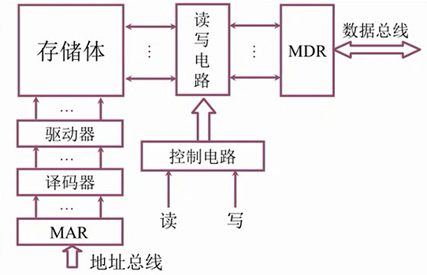
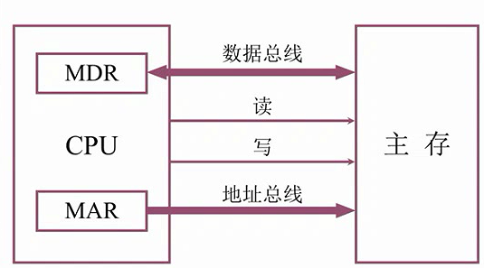
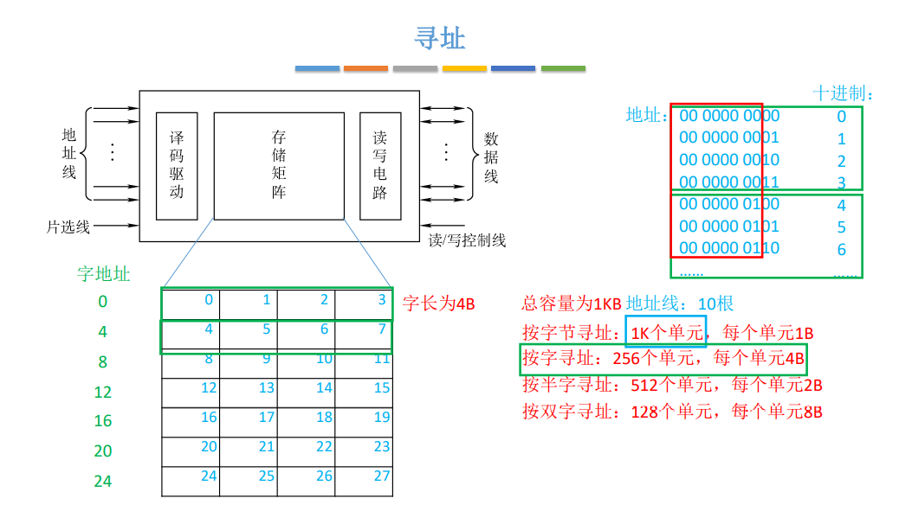

# 3.4 主存储器与CPU的连接

## 3.4.1 主存连接原理

### 1、主存简单模型

为书3.3.3章节内容

三个输入信号：读/写信号、要读写的数据、数据的主存地址

### 2、连接原理

三个总线：数据总线、地址总线、控制总线（读/写）

### 3、主存的地址单元分配

存储单元的数量：总容量 ÷ 每个单元的容量

地址线的数量：总容量的

## 3.4.2 主存的地址单元分配

