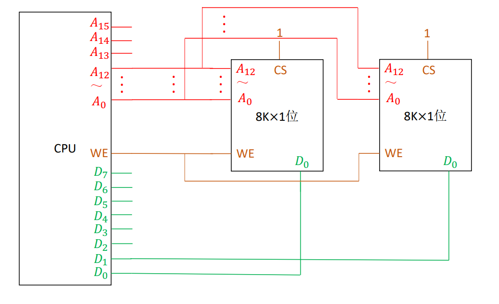
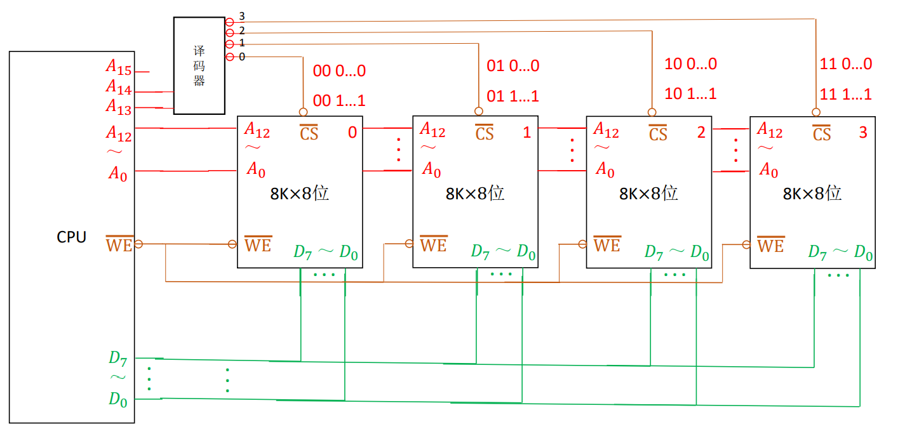
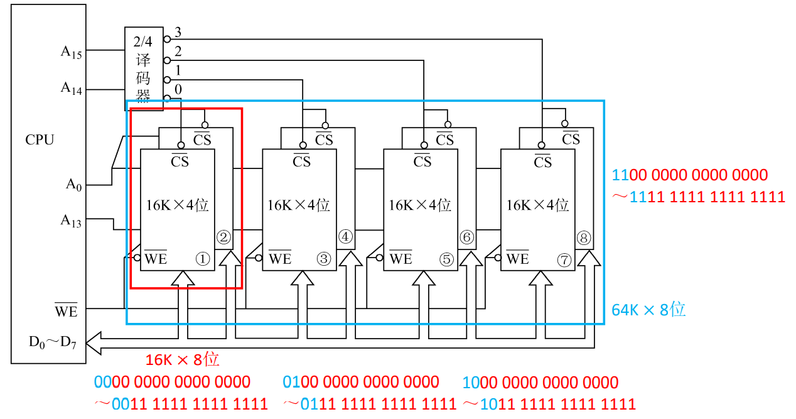

# 3.4 主存储器与CPU的连接

## 3.4.1 主存连接原理

### 1、主存简单模型

为书3.3.3章节内容

三个输入信号：读/写信号、要读写的数据、数据的主存地址

### 2、连接原理

三个总线：数据总线、地址总线、控制总线（读/写）

### 3、主存的地址单元分配

* 存储单元的数量：总容量 ÷ 每个单元的容量
* 地址线的数量：总容量的位数（图中 $$1\text{KB}=2^{10}\text{B}$$，故有10根地址线）
* 如何存放一个字
  * 字长为4B，实际上寻址时将四个存储单元看作一个
  * 一组内有4个存储单元，后两位表示序号，前面表示所在组
  * 每个存储单元存放两位十六进制数（8位二进制数）
  * 共四个存储单元，也就是一个字

## 3.4.2 主存容量的扩展

### 1、位扩展法

* 地址线、片选线和读写控制线**并联**
* 数据线依次连接CPU数据线的一位

如上图中就将8片 $$8K \times 1$$位的储芯片扩展为了 $$8K \times 8$$位

### 2、字扩展法

* 数据线、读写控制线和地址线**并联**
* 使用PU剩下的地址线连接片选线，选择当前读/写的芯片
  * 线选法：直接将地址线与片选线连接，一根地址线对应一根片选线
  * 译码器片选法：使用译码器将连接CPU地址线与片选线

<table>
  <thead>
    <tr>
      <th style="text-align:center">&#x7EBF;&#x9009;&#x6CD5;</th>
      <th style="text-align:center">&#x8BD1;&#x7801;&#x5668;&#x7247;&#x9009;&#x6CD5;</th>
    </tr>
  </thead>
  <tbody>
    <tr>
      <td style="text-align:center">n&#x6761;&#x7EBF; &#x2192; n&#x4E2A;&#x9009;&#x7247;&#x4FE1;&#x53F7;</td>
      <td
      style="text-align:center">n&#x6761;&#x7EBF; &#x2192; &#x4E2A;&#x9009;&#x7247;&#x4FE1;&#x53F7;</td>
    </tr>
    <tr>
      <td style="text-align:center">&#x7535;&#x8DEF;&#x7B80;&#x5355;</td>
      <td style="text-align:center">&#x7535;&#x8DEF;&#x590D;&#x6742;</td>
    </tr>
    <tr>
      <td style="text-align:center">
        
&#x5730;&#x5740;&#x7A7A;&#x95F4;&#x4E0D;&#x8FDE;&#x7EED;

        
&#xFF08;&#x5F62;&#x5982;11&#x3001;00&#x7684;&#x4FE1;&#x53F7;&#x662F;&#x65E0;&#x6548;&#x7684;&#xFF09;

      </td>
      <td style="text-align:center">
        
&#x5730;&#x5740;&#x7A7A;&#x95F4;&#x53EF;&#x8FDE;&#x7EED;

        
&#x53EF;&#x4EE5;&#x589E;&#x52A0;&#x903B;&#x8F91;&#x8BBE;&#x8BA1;

      </td>
    </tr>
  </tbody>
</table>

### 3、字位扩展

