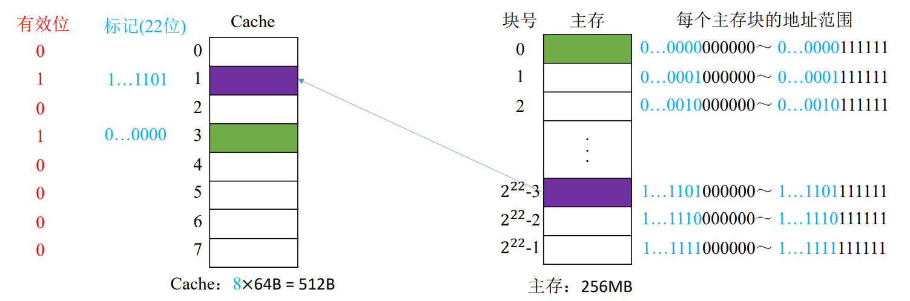
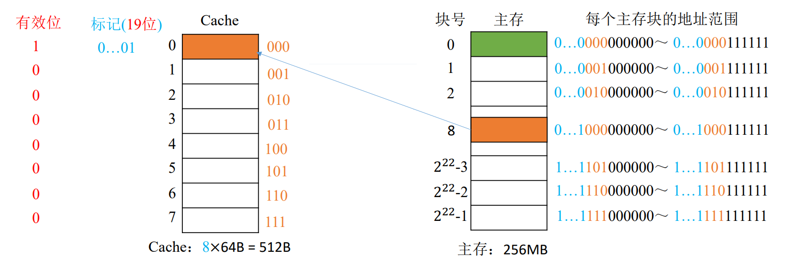
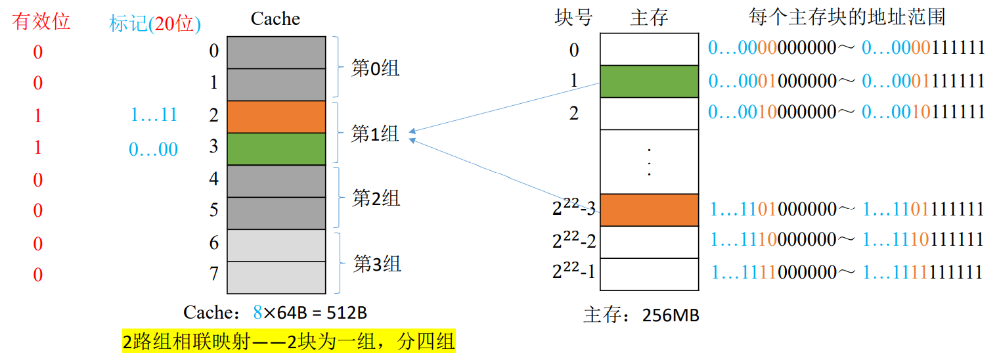

# 3.6 高速缓冲存储器

## 3.6.1 局部性原理

**时间局部性**：在最近的未来要用到的信息，很可能是现在正在使用的信息

**空间局部性**：在最近的未来要用到的信息（指令和数据），很可能与现在正在使用的信息在存储空间上是邻近的

## 3.6.2 Cache的工作原理

基于局部性原理，可以把CPU目前访问的地址周围的部分数据放到Cache中。

将主存与Cache分为同样大小的块（见操作系统“分页”相关内容），**主存和Cache之间以块为单位进行数据交换**。系统访问主存时，会将这一块的内容同时复制到Cache中。

### Cache的性能分析

**命中率**H：CPU欲访问的信息已在Cache中的比率

**缺失（未命中）率**：$$M=1-H$$ 


设 $$t_{c}$$为访问一次Cache所需时间， $$t_{m}$$为访问一次主存所需时间，则Cache-主存系统的平均访问时间t为

$$t=H\cdot t_{c}+(1-H)(t_{c}+t_{m})$$ 

**先访问Cache，若Cache未 命中再访问主存**

或是 $$t=H\cdot t_{c}+(1-H)t_{m}$$ 

同时访问Cache和主存，**若Cache命中则立即停止访问主存**


## 3.6.3 Cache和主存的映射方式

Cache需要设置有效位，表明此块是否有效；

Cache中设置标记，与主存块号相等，表示存储的主存块。

假设计算机的主存地址空间大小为256MB, 按字节编址，其数据Cache有8个Cache行，行长为64B。则：

### 1、全相联映射

主存块可以存放在Cache的任何位置。

* $$256 \text{M} = 2^{28}$$，主存地址共28位
* Cache行与主存块大小相等， $$64 \text{B} = 2^6$$，块内地址为6位
* 主存共有块号为22位
* Cache中有一位有效位，22位标志位

#### 访存过程

1. 用所要访问的主存地址的前22位，对比Cache中所有块的标记；
2. 若标记匹配且有效位=1，则Cache命中，访问相应块内地址的单元；
3. 若未命中或有效位=0，则正常访问主存

#### 优缺点

* 优点
  * Cache存储空间利用充分
  * 命中率高
* 缺点
  * 查找标记最慢
  * 有可能需要对比所有行的标记

### 2、直接映射

每个主存块只能放在特定的位置。

$$
\text{主存块在Cache中的位置} = \text{主存块号} \% \text{Cache总块数}
$$

* 本例中有8个Cache块，对8取余的实质是**取二进制的后三位**
* Cache的序号即可反映主存块的后三位，因此标记中不再记录后三位，节省空间
* 主存块号可以依此细分为**19位标记**和**3位行号**

#### 访存过程

1. 根据主存块号的后3位确定**Cache行；** 
2. 若主存块号的前19位与Cache标记匹配，且有效位=1，则Cache命中，访问相应块内地址的单元；
3. 若未命中或有效位=0，则正常访问主存

#### 优缺点

* 优点
  * 对于任意一个地址，只需对比一个标记，速度最快
* 缺点
  * Cache存储空间利用不充分
  * 命中率低

### 3、组相联映射

将Cache块分组，每个主存块只能存放到特定的分组中。当分组中有空位时，就将该主存块中的内容存入。

$$
\text{主存块在Cache中的位置} = \text{主存块号} \% \text{Cache分组数}
$$

* 本例中分了4组，对4取余实际上是**取二进制的后两位**
* 同理，不记录后两位，节省标志位空间
* 主存块号可以依此细分为**20位标记**和**2位组号**

#### 访存过程

1. 根据主存块号的后2位确定所属分组号
2. 若主存块号的前20 位与分组内的某个标记匹配且有效位=1， 则Cache命中，访问相应块内地址的单元；
3. 若未命中或有效位=0，则正常访问主存

#### 优缺点

两种方法的折中，效果最好

## 3.6.4 Cache替换算法

当Cache中存满时，需要用相应的算法替换掉已有的数据。

根据映射方式不同，存在不同的替换方式。其中**直接映射不需要替换算法**（是一对一的，直接顶替就行）。

### 1、随机算法（RAND）

若Cache已满，则随机选择一块替换。

* 优点
  * 实现简单
* 缺点
  * 没有考虑局部性原理
  * 命中率低

### 2、先进先出算法（FIFO）

若Cache已满，则**替换最先被调入Cache的块**。

从硬件层面，可以在将主存块存入Cache块时按照Cache块序号**顺序存入**，则替换时也仅需要顺序替换即可替换最先存入的。

* 优点
  * 实现简单
* 缺点
  * 没有考虑到局部性原理
  * 会出现**抖动现象**（块被频繁的换入换出）

### 3、近期最少使用算法（LRU）

为每一个Cache块设置一个计数器，用于记录每个Cache块已经有多久没被访问了。当Cache满后**替换计数器最大的**。


从题目的角度，仅需要向前数n个访问的块，则第n+1个块就是要替换的。（n为Cache块数）


#### 算法逻辑

* 命中时
  * 所命中的行的计数器清零
  * **计数器值比被命中的块的值低的块**，计数器加1
  * 其余不变
* 未命中
  * 还有空闲行时
    * 新装入的行的计数器置0
    * 其余非空闲行全加1
  * 无空闲行时
    * 计数值最大的行的信息块被淘汰
    * 新装行的块的计数器置0
    * 其余全加1


Cache块数为 $$2^{n}$$个，则计数器的位数仅需要n位。


* 优点
  * 遵循了局部性原理
  * Cache命中率高
* 缺点
  * 若被频繁访问的**主存块数量>Cache行的数量**，则有可能发生**抖动**

### 4、最近不经常使用算法（LFU）

为每一个Cache块设置一个计数器，用于记录**每个Cache块被访问过几次**。

每被访问一次，计数器+1当Cache满后**替换计数器最小的**。

* 缺点
  * 计数器可能需要很大的长度
  * 曾经被经常访问的主存块在未来不一定会用到

实际运行时效率不如LRU。

## 3.6.5 Cache写策略

### 1、写命中时

#### 写回法

当CPU对Cache写命中时，只修改Cache的内容，而不立即写入主 存，只有当此块<mark style="color:orange;">**被换出时**</mark>才写回主存。

对每一个Cache行增加一个**脏位**，标记该行是否被修改过。只有被修改过的块才进行写回操作。

* 优点
  * 减少了访存次数
* 缺点
  * 存在数据不一致的隐患

#### 全写法

当CPU对Cache写 命中时，必须把<mark style="color:orange;">**数据同时写入Cache和主存**</mark>，一般使用写缓冲(write buffer)。

写缓冲通过SRAM来实现。

* 优点
  * 能保证数据的一致性
* 缺点
  * 访存次数增加
  * 速度变慢
  * 当写操作较多时，写缓冲队列会饱和

### 2、写不命中

#### 写分配法

当CPU对Cache写不命中时，把主存中的块调入Cache，**在Cache中修改**。

通常<mark style="color:orange;">**搭配写回法使用**</mark>。

#### 非写分配法

当CPU对Cache写不命中时**只写入主存**，不调入Cache。只有读未命中时才调入Cache。

<mark style="color:orange;">**搭配全写法使用**</mark>。

### 3、多级Cache

现代计算机采用多级Cache。其中

* 越靠近CPU
  * 容量越小
  * 速度越快
* 越远离CPU
  * 容量越大
  * 速度越慢

其中
