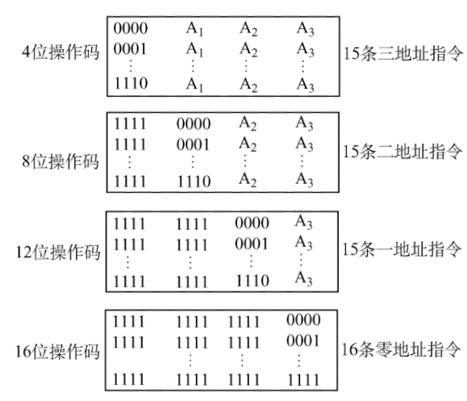

# 4.1 指令格式


指令是指示计算机执行某种操作的命令， 是计算机运行的**最小功能单位**。 

一台计算机的所有指令的集合构成该机的指令系统，也称为**指令集**。


## 4.1.1 指令的基本格式

指令是一段有意义的二进制码，包括两个部分：操作码字段和地址码字段。

**操作码**：指令要进行什么操作，具有何种功能

**地址码**：被操作信息的地址

### 1、按照地址码数量分类

#### （1）零地址指令

* 不需要操作数，如空操作、停机、关中断等指令
* 堆栈计算机，两个操作数隐含存放在栈顶和次栈顶，计算结果压回栈顶

#### （2）一地址指令

* 只需要单操作数，如加1、减1、取反、求补等

指令含义：$$\text{OP}(A_{1})\to A_{1}$$

完成一 条指令需要<mark style="color:purple;">**3次访存**</mark>：取指→读A1→写A1

* 需要两个操作数，但其中一个操作数隐含在某个寄存器（如隐含在ACC）

指令含义：$$(ACC)\text{OP}(A_{1})\to ACC$$

完成一条指令需要<mark style="color:purple;">**2次访存**</mark>：取指→读A1


A1指某个主存地址

(A1)表示A1所指向的地址中的内容


#### （3）二地址指令

需要两个操作数的算术运算、逻辑运算相关指令

指令含义：$$(A_{1})\text{OP}(A_{2})\to A_{1}$$

完成一条指令需要<mark style="color:purple;">**访存4次**</mark>：取指→读A1→读A2→写A1

#### (4)三地址指令

需要两个操作数的算术运算、逻辑运算相关指令

指令含义：$$(A_{1})\text{OP}(A_{2})\to A_{3}$$

完成一条指令需要<mark style="color:purple;">**访存4次**</mark>：取指→读A1→读A2→写A3

#### （5）四地址指令

与三地址指令相同，A4中存放下一条要执行的指令的地址。


一般来说，程序执行完毕后，会将PC（程序计数器）+1

而四地址指令会将PC的值置为A4


### 2、按照指令长度分类

**指令字长**：一条指令的总长度（可能会变）

**机器字长**：CPU进行一次整数运算所能处理的二进制数据的位数（通常和ALU直接相关）

**存储字长**：一个存储单元中的二进制代码位数（通常和MDR位数相同）

**半字长指令、单字长指令、双字长指令**：指令长度是机器字长的多少倍。指令长度影响取指令的时间。

**定长指令字结构**：指令系统中<mark style="color:orange;">**所有指令的长度都相等**</mark>

**变长指令字结构**：指令系统中各种<mark style="color:orange;">**指令的长度不等**</mark>

### 3、按照操作码长度分类

**定长操作码**：指令系统中所有指令的<mark style="color:orange;">**操作码长度都相同**</mark>

* 译码电路设计简单
* 灵活性较差

**可变长操作码**：指令系统中各指令的<mark style="color:orange;">**操作码长度可变**</mark>

* 译码电路设计复杂
* 灵活性高

### 4、按照操作类型分类

#### （1）数据传送类

进行主存与CPU之间的数据传送

* LOAD：把存储器（源）中的数据放到寄存器（目标）中
* STORE：把寄存器（源）中的数据放到存储器（目标）中

#### （2）运算类

* 算数逻辑运算
  * 算术：加、减、乘、除、增1、减1、求补、浮点运算、十进制运算
  * 逻辑：与、或、非、异或、位操作、位测试、位清除、位求反
* [移位操作](../di-er-zhang-shu-ju-de-biao-shi-he-yun-suan/2.2-ding-dian-shu-de-biao-shi-yu-yun-suan.md#1-ding-dian-shu-de-yi-wei-yun-suan)
  * 算术移位、逻辑移位、循环移位（带进位和不带进位）

#### （3）程序控制类

改变程序执行的顺序

* 无条件转移：JMP
* 条件转移
  * JZ：结果为0
  * JO：结果溢出
  * JC：结果有进位 
* 调用和返回：CALL和RETURN
* 陷阱(Trap)与陷阱指令

#### （4）输入输出操作

CPU寄存器与I/O端口之间的数据传送（端口即I/O接口中的寄存器）

## 4.1.2 扩展操作码指令格式

扩展操作码指令格式采用<mark style="background-color:purple;">**定长指令字结构**</mark>+<mark style="background-color:orange;">**可变长操作码结构**</mark>


n位操作码代表指令系统最大能够表达$$2^{n}$$条指令


### 扩展操作码举例

设指令字长为16位，每个地址码占4位

用全部为1标识地址数量，因此实际可用指令数量为$$2^{n}-1$$


例：指令字长为16位，设计一套有15条三地址指令、12条二地址指令、62条一地址指令、32条零地址指令的指令系统。

- 地址长度：16bit/4=4bit
- 三地址指令
  - 16-3*4 = 4bit 操作码
  - $$2^4-15=1$$，剩余1111
- 二地址指令
  - 头部必须为1111，16 - 4 - 2*4 = 4bit
  - $$2^4-12=4$$，剩余1100、1101、1110、1111，头两位全部为11
- 一地址指令
  - 头部必须为1111 11，16 - 6 - 4 = 6bit
  - $$2^6 - 62 = 1$$，剩余111110
- 零地址指令
  - 头部必须为1111 1111 111，16 - 11 = 5bit
  - $$2^5 -32=0$$，分配完毕



* 优点
  * 在指令字长有限的情况下保证了比较丰富的指令种类
* 缺点
  * 增加了指令译码和分析的难度
  * 使控制器设计复杂
