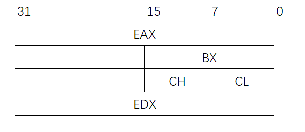

# 4.4 程序的机器级代码

## 4.4.1 x86汇编指令

### 一、指令格式

> 指令 目的操作数 源操作数


mov <mark style="color:blue;">eax</mark>, <mark style="color:blue;">ebx</mark>

将<mark style="color:blue;">寄存器ebx</mark>的值复制到<mark style="color:blue;">寄存器eax</mark>


mov <mark style="color:blue;">eax</mark>, <mark style="color:purple;">5</mark>

将<mark style="color:purple;">立即数5</mark>的值复制到<mark style="color:blue;">寄存器eax</mark>


mov <mark style="color:blue;">eax</mark>, <mark style="color:red;">dword ptr</mark> <mark style="color:green;">[af996h]</mark>

将<mark style="color:green;">内存地址[af996h]</mark>所指的<mark style="color:red;">32bit</mark>值复制到<mark style="color:blue;">寄存器eax</mark>


mov <mark style="color:red;">byte ptr</mark> <mark style="color:green;">[af996h]</mark>, <mark style="color:purple;">5</mark>

将<mark style="color:purple;">立即数5</mark>的值复制到<mark style="color:green;">内存地址[af996h]</mark>所指的<mark style="color:red;">一字节</mark>中



指明内存读写的长度

- **dword ptr**：双字，32bit
- **word ptr**：单字，16bit
- **byte ptr**：字节，8bit




### 二、常用寄存器

E：(Extended)，32bit

- **通用寄存器**（X：未知）
  - EAX
  - EBX
  - ECX
  - EDX



通用寄存器可以继续细分为16bit和8bit的





- **变址寄存器**（I：Index）
  - ESI：（Source）源操作数
  - EDI：（Destination）目的操作数
- **堆栈寄存器**
  - EBP：（Base Pointer）堆栈基指针
  - ESP：（Stack Pointer）堆栈顶指针


## 4.4.2 常用指令

### 一、算术运算

```assembly
add d,s #加法
sub d,s #减法
```


### 其他写法

- [……]、(……)：主存地址，可以存在加减法
- 主存没有指令长度<mark style="color:orange;">**默认32bit**</mark>
- %：寄存器前缀
- \$：立即数前缀
- 8(%EDX, %EAX, 2)，[EDX+EAX*2+8]
  - 偏移量为8
  - 基址寄存器EDX
  - 变址寄存器EAX
  - 比例因子2
