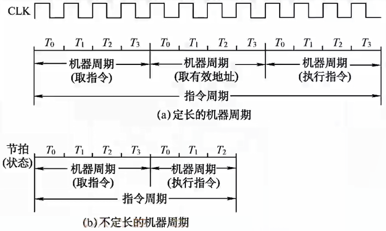
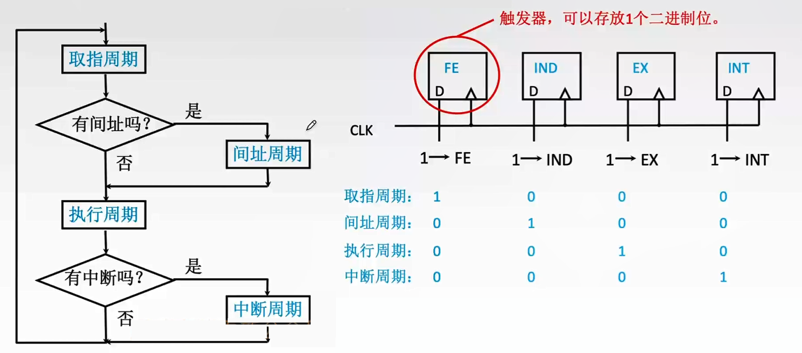
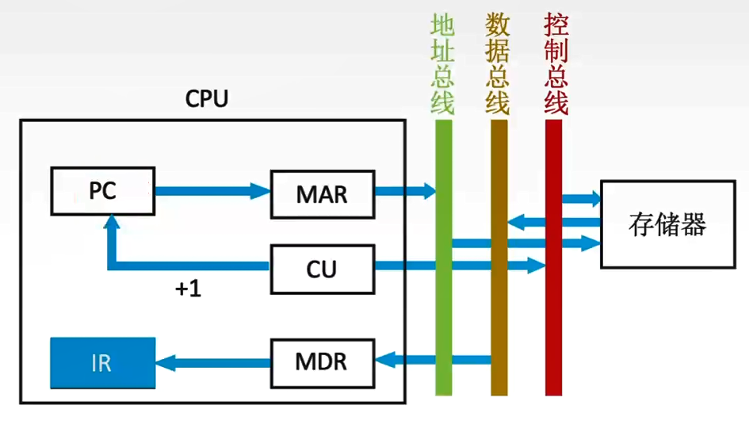
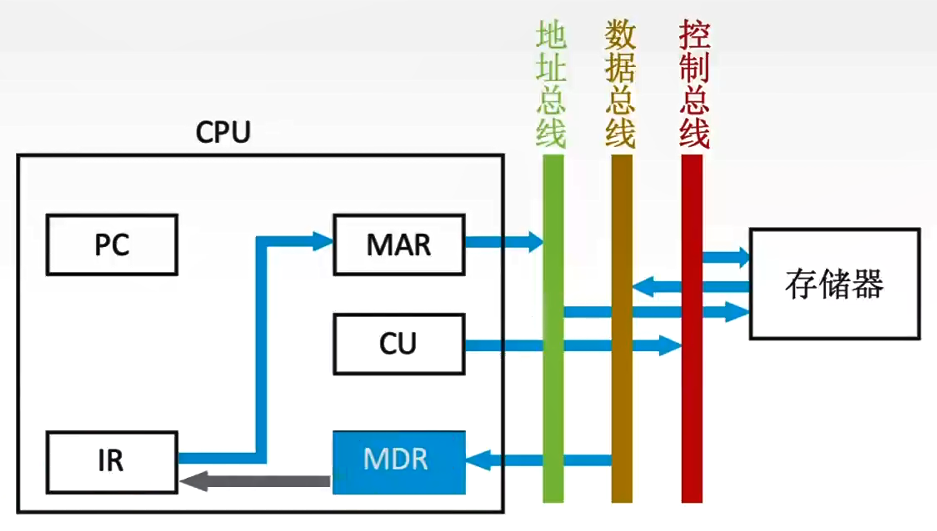
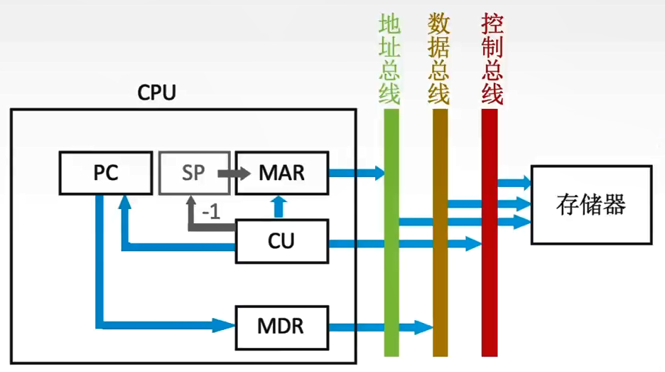

# 5.2 指令执行过程

## 5.2.1 指令周期


指令周期：CPU从主存中取出并执行一条指令的全部时间。


一个**指令周期**由若干<mark style="color:orange;">**机器周期**</mark>表示，机器周期也叫**CUP周期**。

一个**机器周期**包含若干<mark style="color:orange;">**时钟周期（节拍）**</mark>，时钟周期是CPU操作的最基本单位。

* 每个指令周期内机器周期可以不相等
* 每个机器周期内节拍数也可以不相等 

完整的指令周期如下图所示：

运行时，通过**触发器**来判断当前处于指令周期内的哪一个阶段。

## 5.2.2 指令周期的数据流

### 1、寻址周期


根据PC的内容从主存中取出指令并存入IR


1. 将当前指令地址送到<mark style="color:purple;">**存储地址寄存器**</mark>
   1. $$\text{(PC)} \to \text{MAR}$$
2. CU发出控制信号，由控制总线传到主存，标明是<mark style="color:orange;">**读信号**</mark>
   1. $$1 \to \text{R}$$
3. 将MAR指向的主存中的内容经<mark style="color:purple;">**数据总线**</mark>传至MDR
   1. $$\text{M(MAR)} \to \text{MDR}$$
4. 将MDR中的数据送入<mark style="color:purple;">**指令寄存器IR**</mark>
   1. $$\text{(MDR)} \to \text{IR}$$
5. CU发出控制信号，形成下一条指令的地址
   1. $$\text{(PC)}+1 \to \text{PC}$$

### 2、间址周期


取操作数的有效地址


1. 将指令的地址码送入MAR
   1. $$\text{Ad(IR)} \to \text{MAR}$$
2. CU发出控制信号，表示读操作
   1. $$1 \to \text{R}$$
3. 将MAR所指主存中的内容传入MDR
   1. $$\text{M(MAR)} \to \text{MDR}$$
4. 将得到的有效地址送入IR
   1. $$\text{(MDR)} \to \text{Ad(IR)}$$

### 3、执行周期


取操作数，根据IR中的操作码进行相关运算


执行周期的数据流向视不同指令而定，没有统一的数据流向。

### 4、中断周期


中断执行前需要保存当前程序的<mark style="color:orange;">**断点**</mark>。

断点一般采用堆栈保存，SP为栈顶指针，进栈的操作顺序为先修改指针，再存入数据。


1. CU控制SP减一，并将修改后的栈顶地址存入MAR
   1. $$\text{(SP)-1}\to \text{SP}$$
   2. $$\text{(SP)}\to \text{MAR}$$
2. CU发出控制信号，表明当前为写操作
   1. $$1 \to \text{W}$$
3. 将断点内容（PC内容）存入MDR
   1. $$\text{(PC)} \to \text{MDR}$$
4. CU将中断程序的入口地址存入PC
   1. $$向量地址 \to \text{PC}$$

## 5.2.3 指令执行方案

### 1、单指令周期

对所有指令都选<mark style="color:orange;">**用相同的执行时间来完成**</mark>。 指令之间<mark style="color:orange;">**串行执行**</mark>，指令周期取决于执行时间最长的指令的执行时间。

会降低整个系统的运行速度。

### 2、多指令周期

对不同类型的指令<mark style="color:orange;">**选用不同的执行步骤来完成**</mark>。 指令之间<mark style="color:orange;">**串行执行**</mark>，可选用不同个数的时钟周期来完成不同指令的执行过程。 

需要更复杂的硬件设计。

### 3、流水线方案

在每一个时钟周期启动一条指令，尽量让多条指令<mark style="color:orange;">**同时运行**</mark>，但各自处在<mark style="color:orange;">**不同的执行步骤**</mark>中。 指令之间<mark style="color:orange;">**并行执行**</mark>。
