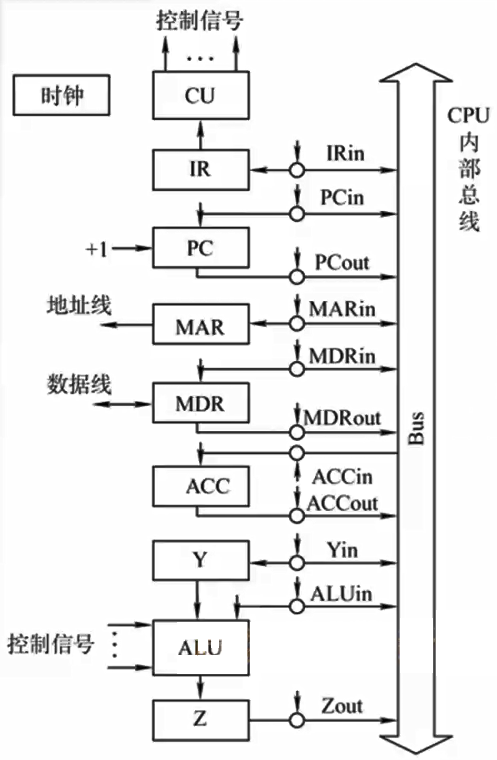

# 5.3 数据通路的功能和基本结构


**数据通路**：数据在功能部件之间传送的路径

数据通路包括数据流经的组件，如ALU、寄存器等




**内部总线**：同一部件，如CP，内部各寄存器和运算部件之间的总线

**系统总线**：计算机系统各部件，如CP、内存、通道和I/O接口之间的总线



## 5.3.1 CPU内部单总线方式

系统结构图如下所示

### 1、寄存器之间的数据传送

设将PC的内容传送至MAR

$$
\begin{align}
&\text{(PC)}\to \text{Bus} &\text{PCout有效}\\
&\text{Bus}\to \text{MAR} &\text{MARin有效}
\end{align}
$$

### 2、主存和CPU之间的数据传输

设CPU从主存读取指令

$$
\begin{align}
&\text{(PC)}\to \text{Bus} \to \text{MAR} &\text{PCout和MARin有效}\\
&\text{1}\to \text{R} &\text{CU置读信号}\\
&\text{MEM(MAR)}\to \text{MDR} &\text{MDRin有效}\\
&\text{MDR}\to \text{Bus} \to \text{IR} &\text{MDRout和IRin有效}\\
\end{align}
$$

### 3、执行算数或逻辑运算

由于ALU两个输入端必须同时有效，而总线只能传输一路数据，因此先将一个输入数据存入暂存寄存器Y

$$
\begin{align}
&\text{Ad(IR)}\to \text{Bus} \to \text{MAR} &\text{IRout和MARin有效}\\
&\text{1}\to \text{R} &\text{CU置读信号}\\
&\text{MEM(MAR)}\to \text{MDR} &\text{MDRin有效}\\
&\text{MDR}\to \text{Bus} \to \text{Y} &\text{MDRout和Yin有效}\\
&\text{(ACC)+(Y)}\to \text{Z} &\text{ACCout和ALUin有效}\\
&\text{Z}\to \text{ACC} &\text{Zout和ACCin有效}\\
\end{align}
$$

## 5.3.2专用数据通路方式

相较于单总线方式，将数据通路的流通方向单独安排线路。

优点是效率高，缺点是硬件量较大。
