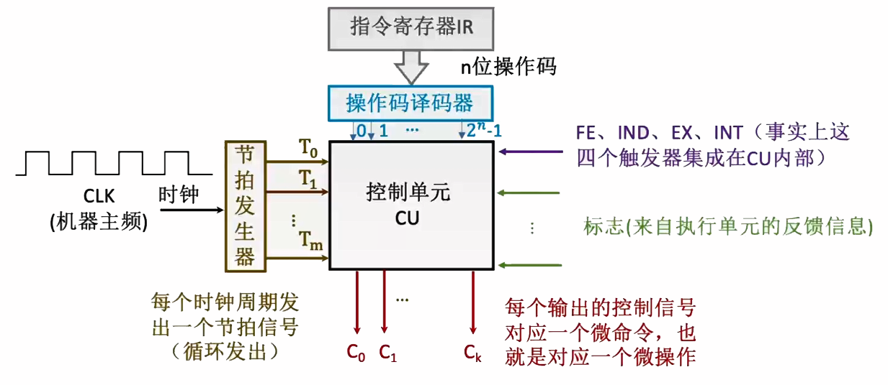
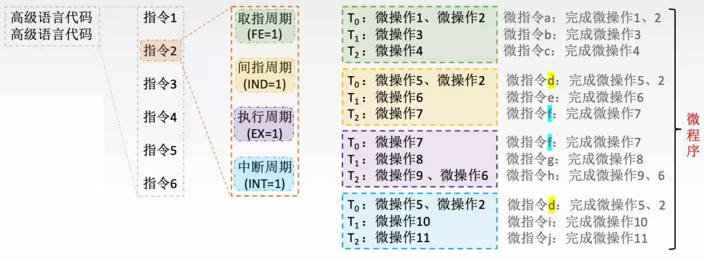
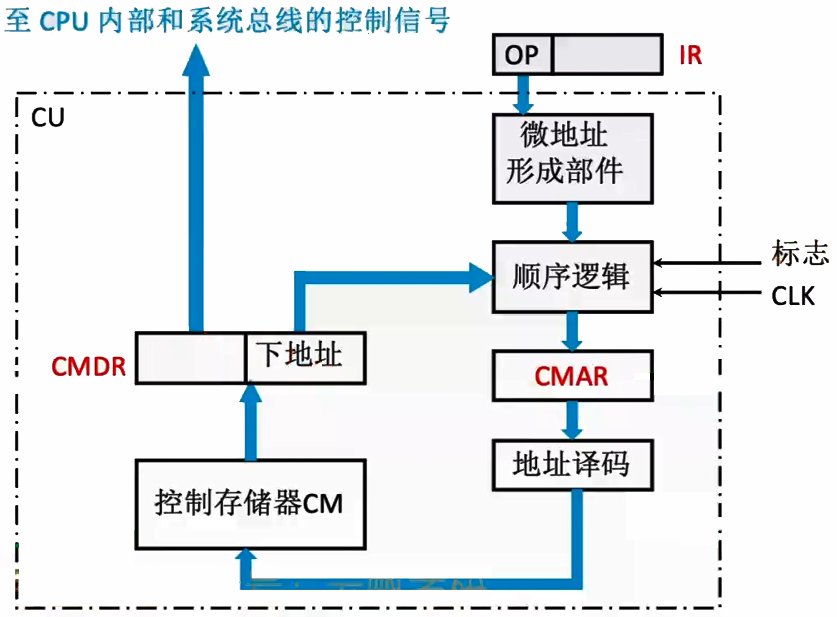
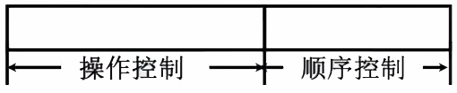
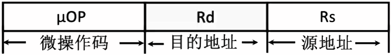
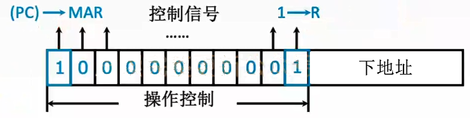
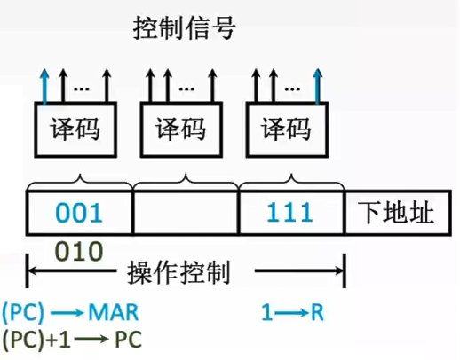

# 5.4 控制器的工作原理和功能

## 5.4.1 硬布线控制器

### 1、硬布线控制器单元图

根据<mark style="color:blue;">**指令操作码**</mark>、<mark style="color:purple;">**当前的机器周期**</mark>、<mark style="color:orange;">**节拍信号**</mark>、<mark style="color:green;">**机器状态条件**</mark>即可确定当前节拍下应发出什么<mark style="color:red;">**微命令**</mark>。

- 通过判断取值周期、节拍数和具体指令操作码，写出逻辑表达式
- 将逻辑表达式以电路实现

### 2、硬布线控制器的设计

1. 分析每个阶段的微操作序列
   - 会用到哪些指令
   - 在什么阶段用到
   - 在什么条件下用到
2. 选择CPU控制方式
   - 定长周期 & 不定长周期
   - 每个机器周期几个节拍
3. 安排微操作时序
   - 哪些微操作在前，那些在后
   - 每个节拍内安排多少指令
4. 电路设计
   1. 列出操作时间表
   2. 写出微操作命令的最简表达式
   3. 画出逻辑图

### 3、安排微操作时序的原则

- 微操作的<mark style="color:orange;">**先后顺序**</mark>不得随意更改
  - 先分析指令的依赖顺序
- 被控对象<mark style="color:orange;">**不同**</mark>的微操作尽量安排在<mark style="color:orange;">**一个节拍内**</mark>完成
- <mark style="color:orange;">**占用时间较短**</mark>的微操作尽量安排在一个节拍内完成，并允许有先后顺序
  - 同样在CPU内部的寄存器之间的数据流可以安排在一个周期内
  - 主存和内部寄存器之间的数据操作不能在一个节拍内

### 4、硬布线控制器的特点

- 一般用于RISC （精简指令集系统）
- 扩充指令较困难
- 执行速度很快，微操作控制信号由组合逻辑电路即时产生

## 5.4.2 微程序控制器

### 1、微程序控制器的设计思路



采用<mark style="color:orange;">**存储程序**</mark>思想，出厂前将所有指令的<mark style="color:purple;">**微程序**</mark>存入<mark style="color:purple;">**控制器存储器**</mark>中



- **程序**：由指令序列组成
- **指令**：对程序执行步骤的描述
- **微操作**：每一条指令包含若干微操作，<mark style="color:orange;">**微命令与微操作一一对应**</mark>
- **微指令**：对指令执行步骤的描述，<mark style="color:orange;">**可能包含多个微命令**</mark>
- **微程序**：由微指令序列组成，<mark style="color:orange;">**指令与微程序一一对应**</mark>

### 2、微程序控制器的基本结构

- **控制存储器CM**：存放微程序，由<mark style="color:purple;">**ROM**</mark>构成
- **CMAR（μPC）**：微地址寄存器，相当于PC和MAR的作用
- **地址译码**：处理微地址，转化为CM控制信号
- **CMDR（μIR）**：存储从CM中取出的微指令，位数与微指令字长相等
- **微地址形成部件**：通过IR中指定的操作码确定该指令对应的微指令序列的首微地址
- **顺序逻辑**：控制微指令的执行顺序
  - 可以通过机器指令的寻址特征判断寻址方式，决定是否要跳过间址周期



- 一个微程序理论上包括寻址周期微程序、间址周期微程序、执行周期微程序和中断周期微程序四个微程序段
- 取值周期、间址周期和中断周期的微程序通常是共用的
- 若有n条指令，则最少有n+1条微程序段（可能会没有间址周期和中断周期）



### 3、微指令的格式

#### （1）水平型微指令

一条微指令能定义<mark style="color:orange;">**多个**</mark>可并行的微命令。

- 优点
  - 微程序短
  - 执行速度快
- 缺点
  - 微指令长
  - 编写麻烦

#### （2）垂直型微指令

一条微指令只能定义<mark style="color:orange;">**一个**</mark>微命令，由微操作码字段规定具体功能

- 优点
  - 微指令短
  - 简单规整，便于编写
- 缺点
  - 微程序长
  - 执行速度慢，工作效率低

#### （3）混合型微指令

在垂直型的基础上增加一些不太复杂的并行操作。

- 微指令较短，仍便于编写
- 微程序也不长，执行速度加快

### 4、微指令的编码方式

讨论水平型微指令中操作控制部分如何编码表示微指令

#### （1）直接编码

- 在微指令的操作控制字段中，每一位代表一个微操作命令。
- 某位为“1”表示该控制信号有效
  

- 优点
  - 简单直观
  - 执行速度快
  - 操作并行性好
- 缺点
  - 微指令字长过长，导致CM容量需求极大S

#### （2）字段直接编码方式

- 将微指令的控制字段分成若干“段” ，每段经译码后发出控制信号
- 分段原则
  - <mark style="color:purple;">**互斥性微命令**</mark>分在<mark style="color:orange;">**同一段内**</mark>，<mark style="color:purple;">**相容性微命令**</mark>分在<mark style="color:orange;">**不同段内**</mark>
  - 每个小段中包含的信息位不能太多，否则将增加译码线路的复杂性和译码时间
  - 一般每个小段还要留出一个状态，表示本字段不发出任何微命令
    - 当某字段的长度为3位时，最多只能表示7个互斥的微命令，通常用000表示不操作



**互斥性微命令**：不允许并行完成的微命令

**相容性微命令**：允许并行完成的微命令





例：某计算机的控制器采用微程序控制方式，微指令中的操作控制字段采用字段直接编码法。共有33个微命令，构成5个互斥类，分别包含7、3、12、5和6个微命令，则操作控制字段至少有多少位?

- 第一个互斥类：$$7+1=8\leq2^{3}$$
- 第二个互斥类：$$3+1=4\leq2^{2}$$
- 第三个互斥类：$$12+1=13\leq2^{4}$$
- 第四个互斥类：$$5+1=6\leq2^{3}$$
- 第五个互斥类：$$6+1=7\leq2^{3}$$
- 总字段数：3+2+4+3+3=15 位



- 优点
  - 可以缩短指令字长
- 缺点
  - 要通过译码电路后再发出微命令，因此比直接编码方式慢

#### （3）字段间接编码

一个字段的某些微命令需由另一个字段中的某些微命令来解释，由于不是靠子段直接译码发出的微命令，故称为字段间接编码，又称隐式编码。

- 进一步缩短指令字长
- 执行更慢

### 5、微指令的地址形成方式

- 通过微指令的<mark style="color:purple;">**下地址字段**</mark>指出
- 依据机器指令的<mark style="color:purple;">**操作码**</mark>形成
  - 机器指令放入IR
  - 微地址形成部件通过机器指令的操作码部分形成微指令的地址
- <mark style="color:orange;">**增量计数器法**</mark>：（CMAR）+1 → CMAR，类似PC
- 分支转移
  - 转移方式：指明判别条件
  - 转移地址：指明转移成功后的去向

- 通过测试网络
- 由硬件产生微程序入口地址
  - 取值周期的第一条微指令的地址由硬件自动给出

### 6、微程序控制单元的设计

#### （1）设计步骤

1. 分析每个阶段的微操作序列
2. 写出对应机器指令的微操作命令及节拍安排
   - 写出每个周期所需要的微操作（与硬布线相同）
   - 添加微程序控制器特有的微操作
     - 取值周期
       - 每条微指令执行结束之后：Ad(CMDR)→CMAR，指明下地址
       - 最后一条执行结束后：OP(IR)→微地址形成部件→CMAR，确定执行周期的微程序首地址
     - 执行周期
       - 指明下地址：Ad(CMDR)→CMAR
3. 确定微指令格式
   - 根据操作码的编码方式确定**操作控制字段**的位数
   - 根据CM中的微指令总数确定**顺序控制字段**的位数
   - 根据操作控制字段和顺序控制字段的长度确定微指令字长
4. 编写微指令码点

#### （2）微程序设计分类

- **静态**微程序设计：
  - 微程序无需改变
  - 采用ROM
- **动态**威程序设计
  - 通过改变微指令和微程序改变机器指令
  - 有利于仿真
  - 采用EPROM

**毫微程序设计**：用毫微程序解释微程序（更进一步）

### 7、微程序控制器的特点

- 执行速度慢
- 较规整，易于扩充修改
- 适用于CISC（复杂指令集系统）
