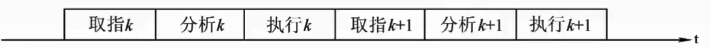
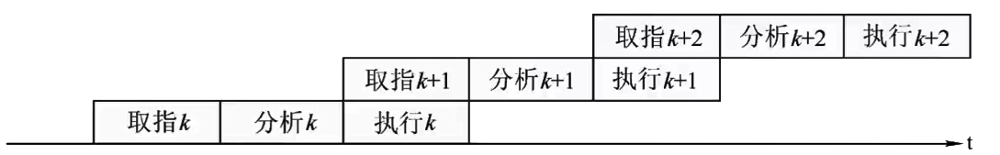
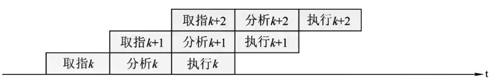
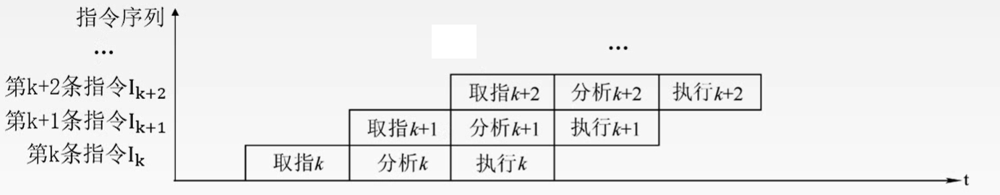
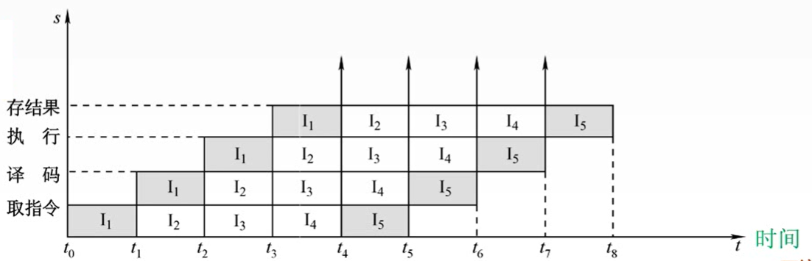
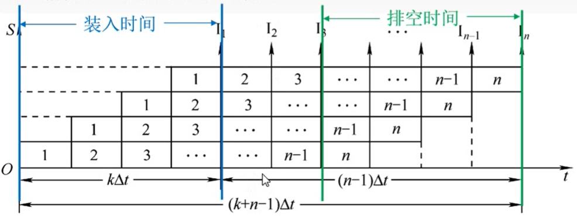

# 5.5 指令流水线

## 5.5.1 流水线的概念

### 1、指令流水的定义

将指令执行过程划分为<mark style="color:orange;">**不同的阶段**</mark>，占用<mark style="color:orange;">**不同的资源**</mark>，使得多条指令<mark style="color:orange;">**同时执行**</mark>。

#### （1）顺序执行方式

时间：$$T=3nt$$

传统冯诺依曼结构，又称<mark style="color:purple;">**串行执行方式**</mark>。

- 优点
  - 控制简单，硬件代价小
- 缺点
  - 执行指令的速度较慢，
  - 各功能部件的利用率很低

#### （2）一次重叠执行方式

时间：$$T=3t+(n-1)\times 2t=(1+2n)t$$

- 优点
  - 程序的执行时间缩短了1/3
  - 各功能部件的利用率明显提高。
- 缺点
  - 需要付出硬件上较大开销的代价
  - 控制过程比顺序执行复杂

#### （3）二次重叠执行方式

时间：$$T=3t+(n-1)t=(2+n)t$$

时间更短



实际使用中也可以分成更多段，如4段甚至5段



### 2、流水线的表示方法

#### （1）指令执行过程图

主要用于分析指令执行过程以及影响流水线的因素

#### （2）时空图

主要用于分析流水线的性能

## 5.5.2 流水线的性能指标

### 1、吞吐率

吞吐率是指在单位时间内流水线所**完成的任务数量**，或是输出结果的数量

- 吞吐率：$$\text{TP}=\frac{n}{T_{k}}$$
  - $$n$$：任务数量
  - $$T_{k}$$：完成n个任务的总时间
- 理想状态下的流水线时空图

- 一条指令的执行分为k个阶段
- 每个阶段耗时$$\Delta t$$

$$
\begin{align}
&T_{k} = [k+(n-1)]\Delta t\\
&\text{TP}=\frac{n}{k+n-1}\Delta t\\
&\text{TP}_{max}=\lim_{n \to \infty}\text{TP} = \frac{1}{\Delta t}
\end{align}
$$

### 2、加速比

**不使用**流水线所用的时间与**使用**流水线所用的时间之比。
$$
\text{S}_{max} = \lim_{n\to \infty}\text{S}=k
$$

### 3、效率

流水线的<mark style="color:orange;">**设备利用率**</mark>称为流水线的效率。
$$
\begin{align}
&流水线效率 =\frac{任务占用了的时空区域}{总的时空区域}\\
\ \\
&\text{E}_{max} = \lim_{n\to \infty}\text{E}=1
\end{align}
$$

## 5.5.3 指令流水线的分类



**5段式指令流水线**

- **取指IF**（instruction fetch）
- **指令译码ID**（instruction decode）
- **执行EX**（execute）
- **访存M**（memory）
- **写回WB**（write back）



