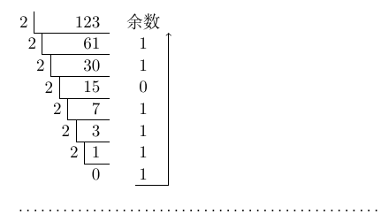
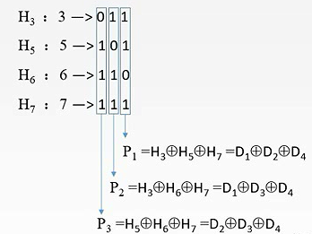

# 2.1 数制与编码

## 2.1.1 进位计数制与相互转换

### 1、进位计数法

**基数**：每个数位所要用到的不同符号的个数（二进制就是2个、8进制就是8个、十进制就是10个...）。

基数越大，**位数**越小，运算情况越多。

位权：依据进制所决定的一个常数（二级制就是2，十进制就是10...）

一个**r进制**数的数值可以表示为：

$$
\sum_{i=n}^{-m}K_{i}r^{i}=K_{n}r^{n} +K_{n-1}r^{n-1}...+K_{0}r^{0}+K_{-1}r^{-1}+ ...+K_{-m}r^{-m}
$$

* r：基数
* $r^{i}$ ：第i位的位权
* $K_{i}$ ：可以取0\~（r-1）中的任意数
* 整数最低位为第0位，小数为负数位


N位r进制的数所能表示的**数字个数**为：$r^N$个

### 2、进制转换

#### （一）、任意进制 --> 十进制

用相应位上的数乘以位权即可。


```admonish
二进制：101.1 --> $1*2^{2} + 0*2^{1} + 1 * 2^{0} + 1 *2^{-1} = 5.5$

八进制：5.4 --> $5*8^{0} + 4* 8^{-1} = 5.5$

十六进制：5.8 --> $5 * 16^{0} + 8 *  16 ^{-1} = 5.5$
```


#### （二）、十进制 --> 任意进制

例：将十进制123.6875转化为二进制

#### 1、除基取余法（整数）

对整数部分的处理使用短除法，并从下向上，得1111011



#### 2、乘基取整法（小数）

小数部分采用乘基取整的思路，如下所示：

$$
\begin{array}{r}
0.6875\\
*\qquad \quad 2\\
\hline
1.3750\\
0.3750\\
*\qquad \quad 2\\
\hline
0.7500\\
*\qquad \quad 2\\
\hline
1.5000\\
0.5000\\
*\qquad \quad 2\\
\hline
1.0000\\
....
\end{array}
\begin{array}{l}
\qquad\\\qquad\\\qquad1 \qquad 最高位\\ \\ \\\qquad0\\ \\\qquad1\\ \\ \\\qquad1\qquad 最低位\\\qquad...\\
\end{array}
$$

一般十进制**无法精确化为**二进制小数，取一定精度即可。

#### （二）、 $2^{n}$ 进制之间的转换

每n位一组，进行对应的转换即可。


```admonish example
例1：将3C2.68H转化为2进制

$$
\underline{0011}\;\underline{1100} \;\underline{0010} . \underline{0110} \;\underline{1000} \\ \quad 3\quad \;\; C\quad\;\;\ 2\;\ .\quad6 \quad\;\;8
$$ 

即：3C2.68H=1111000010.01101B

例2：将1111000010.01101B转化为八进制

$$
\underline{001} \;\underline{111} \;\underline{000} \;\underline{010} .\underline{011} \;\underline{010} \;\\\;\;1\quad\;7\quad\;0\quad\;2\;\;.\;\;3\quad\;2
$$ 

即：1111000010.01101B= $(1702.32)_{8}$
```


## 2.1.2 BCD码

BCD（Binary-Coded Decimal），**使用二进制表示的十进制数**。即使用四位二进制数表示一位十进制数，使得十进制与二进制之间的转换得以快速进行。

### 1、8421码

|   0  |   1  |   2  |   3  |   4  |   5  |   6  |   7  |   8  |   9  |
| :--: | :--: | :--: | :--: | :--: | :--: | :--: | :--: | :--: | :--: |
| 0000 | 0001 | 0010 | 0011 | 0100 | 0101 | 0110 | 0111 | 1000 | 1001 |

使用8421码进行运算时，若结果大于等于10，需要**加6修正**（加0110）。


```admonish example
例：

$$
\begin{align} 4+9 &= 0100B + 1001B\\&=1101B (+0110B) \\&= 10011B\\ &=13 \end{align}
$$ 
```


### 2、余三码

将8421码的每一位加3（即加0011B）得到。

### 3、2421码

将最高位的权值改为2，特点是大于5的四位二进制码最高位是1，小于5的是0.

|   0  |   1  |   2  |   3  |   4  |   5  |   6  |   7  |   8  |   9  |
| :--: | :--: | :--: | :--: | :--: | :--: | :--: | :--: | :--: | :--: |
| 0000 | 0001 | 0010 | 0011 | 0100 | 1011 | 1100 | 1101 | 1110 | 1111 |

## 2.1.3 字符与字符串

### 1、ASCII码

* 32\~126位称为可印刷字符
* A-Z，a-z是连续的，但是Z和a之间不连续
* 以字节的形式存储


```admonish example
例：已知'A'的ASCII码码值是65，H存放在某存储单元M中，求M中存放的值

65+(8-1)=72

72 = 0100 1000
```


### 2、字符串

字符串：IF_ _A>B THEN READ(C) ，每个存储单元存放4B

**大端模式**：存储单元内**先存储高位字节**、**后存储低位字节**的顺序

<font color=orange>**大端方式是正常的**</font>

|     |     |     |     |
| :-: | :-: | :-: | :-: |
|  I  |  F  |  空格 |  A  |
|  >  |  B  |  空格 |  T  |
|  H  |  E  |  N  |  空格 |
|  R  |  E  |  A  |  D  |
|  (  |  C  |  )  |  空格 |

**小端模式**：存储单元内**先存储低位字节**、**后存储高位字节**的顺序

|     |     |     |     |
| :-: | :-: | :-: | :-: |
|  A  |  空格 |  F  |  I  |
|  T  |  空格 |  B  |  >  |
|  空格 |  N  |  E  |  H  |
|  D  |  A  |  E  |  R  |
|  空格 |  )  |  C  |  (  |

### 3、汉字编码

包括输入的**输入编码**，计算机内部处理的**汉字内码**和输出的**汉字字形码**三种。


## 2.1.4 校验码

**码距**：任意两个合法码字之间不同的二进制的位数。

* 码距大于等于2时，开始具有检错能力
* 码距越大，纠错、检错能力越强

### 1、奇偶校验码

添加一个校验位，校验位的取值满足以下规定：

**奇校验码**：整个校验码（有效信息位和校验位）中“1”的个数为奇数。

**偶校验码**：整个校验码（有效信息位和校验位）中“1”的个数为偶数。

即在有效信息的前面添加1或者0即可。

### 2、海明校验码

* 若信息位的位数为n，海明码的位数为k ，则有：

$$
2^{k} \geq n + k + 1\tag{1}
$$

* 将校验位依次放在位于 $$2^{i-1}$$ 位上，并将信息位按照顺序填入剩下的位置
* 海明码的取值相当于将各数据位的第i组的所有位求异或
* 每个校验组分别用校验位和参与计算校验位的信息位进行奇偶校验，并得到响应结果。

例：求1010的海明码

#### 1、确定位数

因为 n=4，则由（1）计算得 k=3

则，设信息位 $D_{4}D_{3}D_{2}D_{1}(1010)$ ，共4位，校验位 $P_{3}P_{2}P_{1}$ ， 共3位，对应的海明码为 $H_{7}H_{6}H_{5}H_{4}H_{3}H_{2}H_{1}$ 。

#### 2、确定校验位的分布

* 将校验码放在$2^{i-1}$位置上

| $H_{7}$ | $H_{6}$ | $H_{5}$ | $H_{4}$ | $H_{3}$ | $H_{2}$ | $H_{1}$ |
| :-----: | :-----: | :-----: | :-----: | :-----: | :-----: | :-----: |
|         |         |         | $P_{3}$ |         | $P_{2}$ | $P_{1}$ |

* 将信息位填入剩下的位置

| $H_{7}$ | $H_{6}$ | $H_{5}$ | $H_{4}$ | $H_{3}$ | $H_{2}$ | $H_{1}$ |
| :-----: | :-----: | :-----: | :-----: | :-----: | :-----: | :-----: |
| $D_{4}$ | $D_{3}$ | $D_{2}$ | $P_{3}$ | $D_{1}$ | $P_{2}$ | $P_{1}$ |
|    1    |    0    |    1    |         |    0    |         |         |

#### 3、求校验位的值

先将信息位的海明位号表示为二进制，再对相应组含有1的求异或



$$
P_{1}=D_{1}\oplus D_{2}\oplus D_{4}=0 \oplus 1 \oplus 1=0\\
P_{2}=D_{1}\oplus D_{3}\oplus D_{4}=0 \oplus 0 \oplus 1=1\\
P_{3}=D_{2}\oplus D_{3}\oplus D_{4}=1 \oplus 0 \oplus 1=0\\
$$

因此有

| $H_{7}$ | $H_{6}$ | $H_{5}$ | $H_{4}$ | $H_{3}$ | $H_{2}$ | $H_{1}$ |
| :-----: | :-----: | :-----: | :-----: | :-----: | :-----: | :-----: |
| $D_{4}$ | $D_{3}$ | $D_{2}$ | $P_{3}$ | $D_{1}$ | $P_{2}$ | $P_{1}$ |
|    1    |    0    |    1    |    0    |    0    |    1    |    0    |

#### 4、纠错

将校验码和**与之相应的**数据位进行异或，应当全部为0。

$$
P_{1}\oplus D_{1}\oplus D_{2} \oplus D_{4}=0\\
P_{2}\oplus D_{1}\oplus D_{3} \oplus D_{4}=0\\
P_{3}\oplus D_{2}\oplus D_{3} \oplus D_{4}=0
$$

得1则说明有错。

### 3、循环冗余校验码

循环冗余校验码包括K位数据位和R位校验位。

例：已知生成多项式 $G(x) = x^{3} +x^{2}+1$ ，信息码为101001，求对应的CRC码

#### 1、确定K、R及生成多项式对应的二进制码

* K = 7
* R = 生成多项式的最高次幂 = 3
  * 则，CRC码的位数 = K + R = 10
* 生成多项式的各次幂的系数就是对应的二进制码：1101（_没有x，故第二位为0_）

#### 2、移位

将信息码**左移R位**，低位补0

101001000

#### 3、模2相除

将 左移后的信息码 除以 生成多项式的二进制码。

每一次相减时，相同得0，不相同得1，**没有借位**。


最后的**余数**就是校验位

因此，CRC码 = 101001 001

#### 4、检错

对于CRC码再次用生成多项式的二进制码进行**模2除法**，余数应为000。
