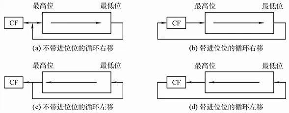
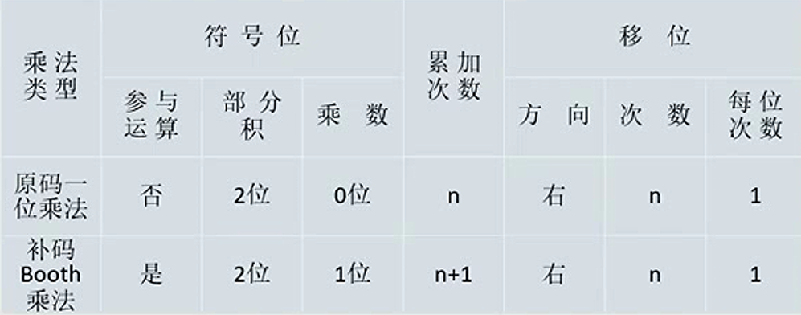
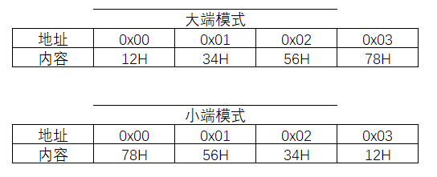
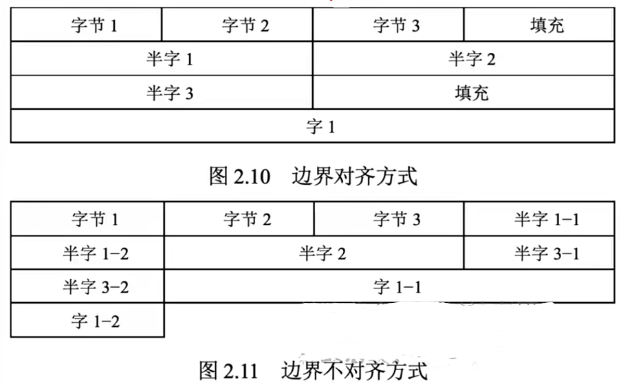

# 2.2 定点数的表示与运算

## 2.2.1 定点数的表示

### 1、无符号数和有符号数

**无符号数**：整个机器字长的全部二进制位均为数值位，没有符号位，相当于数的**绝对值**。

n位无符号数的表示范围是 $0 \sim  2^{n}-1$

#### 有符号数

* **真值**：该数字的实际值，包含正负；
* **机器数**：用数字表示正负号的二进制数
* **定点小数**：约定符号位后面就是小数点
  * \+0.75D = 0.11B
  * \-0.75D =1.11B
  * n位尾数的定点小数的表示范围： $-(1- 2^{-n}) \sim  (1- 2^{-n})$
* **定点整数**：约定小数点在数值的最后
  * \+3D = 011.B
  * \-3D = 111.B
  * n位尾数的定点整数的表示范围：$-(2^{-n}-1) \sim  (2^{-n}-1)$

### 2、原码、补码、反码、移码


```admonish warning
整数的“，”和小数的“.”都是用于表示分割，在计算机中实际不存在
```


#### （1）原码

**用最高位表示符号位**，设 x 为真值，则有：

纯小数的原码： 

$$
[x]_{\text {原 }}= \begin{cases}x & 1>x \geqslant 0 \\ 1-x=1+|x| & 0 \geqslant x>-1\end{cases}
$$

纯整数的原码（n为整数位数）：

$$
[x]_{\text {原 }}= \begin{cases}0, x & 2^{n}>x \geqslant 0 \\ 2^{n}-x=2^{n}+|x| & 0 \geqslant x>-2^{n}\end{cases}
$$

若字长为n+1位，则原码的**表示范围**：$-(2^n-1)\leq x \leq 2^n-1$

#### （2）补码

* 正数的补码：补码与原码相同
* 负数的补码：原码符号位不变，数值位取反，末位加1
* 当一个正数和一个负数互为补数时，他们的绝对值之和称为**模数**。
  * 类似于时钟，+2 = -10，12为模数
* $[+0]_补=[-0]_补=0.0000$

纯小数的补码：

$$
[x]_{\text {补}}=\left\{\begin{array}{ll}
 x & 1>x \geqslant 0 \\2+x=2-|x| & 0 > x \geqslant-1
\end{array} \quad\left(\bmod 2\right)\right.
$$

纯整数的补码

$$
[x]_{\text {补}}=\left\{\begin{array}{ll}
0, x & 2^{n}>x \geqslant 0 \\
2^{n+1}+x=2^{n+1}-|x| & 0 \geqslant x \geqslant-2^{n}
\end{array} \quad\left(\bmod 2^{\mathrm{n}+1}\right)\right.
$$

若字长为n+1位，则补码的**表示范围**：$-2^n\leq x \leq 2^n-1$

#### （3）反码

* 正数的反码：反码与原码相同
* 负数的反码：原码符号位不变，数值位取反

#### （4）移码

移码就是在真值X上加上一个常数(偏置值)  ，通常这个常数取 $2^{n}$ 。


```admonish example
例： $x_{1}=+10101$，$x_{2}=-10101$，字长为8位，则其移码表示为:

$$
\begin{align} [x_{1}]_{移} &= 2^{7} + 10101\\&=10000000+10101 \\&= 1,0010101 \end{align}$$ $$\begin{align} [x_{2}]_{移} &= 2^{7} + (-10101)\\&=10000000+(-10101) \\&= 0,1101011 \end{align}
$$ 
```


- 同一个数，补码和移码**只有符号位相反**
- 移码大真值就大，移码小真值就小
  - 移码全为0：$-2^n$
  - 移码全为1：$2^n-1$
- 移码的0唯一

## 2.2.2 定点数的运算

### 1、定点数的移位运算

对于r进制而言：

* 右移n位： $\div r^{n}$
* 左移n位： $\times r^{n}$

可以与加减法结合实现乘除法。

#### （1）算术移位

机器码采用有符号数，符号位不参与

* 正数
  * 空位补0
* 负数
  * 原码：0
  * 补码：
    * 左移：0
    * 右移：1
  * 反码：1

#### （2）逻辑移位

机器码采用**无符号数**，直接补0。

#### （3）循环移位



### 2、加减法

补码直接相加即可


```admonish example
例：设机器字长为8位（含一位符号位），A=15，B=-24，求 $[A+B]_{补}$ 和$[A-B]_{补}$

先求原码：

$A = +1111 = 0,1111 = 0, 0001111\\ B= -11000 = 1,11000 = 1, 0011000$

则可得补码：

$A = 0,0001111\\ B = 1, 1101000$ 

另外 $[-B]_{补}: [B]_{补}$ 连同符号位一起取反再+1

可得结果：

$$
[A+B]_{补} = [A]_{补} + [B]_{补} = 0,0001111+1,1101000 = 1,1110111\\ [A-B]_{补} = [A]_{补} + [-B]_{补} = 0,0001111+0,0011000 = 0,0100111
$$ 
```


### 3、溢出的概念和判断方式

* 大于机器所能表示的最大正数称为**上溢**；
* 小于机器所能表示的最小负数称为**下溢**。
* 当两个符号**相同**的数**相加**或者两个符号**相异**的数**相减**时才会发生溢出。

对溢出的判断有几种方式：

#### （一）采用一位符号位

设A的符号位为 $A_{S}$ ，B的符号位为$B_{S}$，运算结果的符号位为$S_{S}$，则溢出的逻辑表达式为：

$$
V=A_{\mathrm{S}} B_{\mathrm{S}} \overline{S_{\mathrm{S}}}+\overline{A_{\mathrm{S}}} \overline{B_{\mathrm{S}}} S_{\mathrm{S}}
$$

* 若V=0，则无溢出
* 若V=1，则发生了溢出

#### （二）采用一位符号位根据数据位进位情况判断溢出

即“模2补码”

设符号位的进位 $C_{S}$ ，最高数位的进位$C_{1}$，则当$C_{S}$和$C_{1}$不同时发生溢出。

#### （三）采用双符号位

即“模4补码”

正数符号位为00，负数符号位为11。

记两个符号位分别为$_{S1}$和$_{S2}$，则 $V=S_{S1} \oplus S_{S2}$ ，若V=0，无溢出；V=1，有溢出。

- 00：正数无溢出
- 01：正数有溢出
- 11：负数无溢出
- 10：负数有溢出


```admonish warning
模4补码存储时仍然为一个符号位，因为正确的表示两位符号位必然是相同的

当送入ALU时，才将原来的符号位同时送入ALU的双符号位中
```


### 4、定点数的乘法运算



#### （一）原码一位乘法


```admonish
- 符号位单独处理：乘数与被乘数异或
- 绝对值相乘
  - ACC存放乘积高位，MQ存放乘数、乘积低位，X存放被乘数
  - 每次看MQ中最低位
    - 为1，ACC加上被乘数
    - 为0，ACC加上0
  - 每次运算后右移一位，高位补0
  - 直到MQ仅剩原符号位，舍去不参与运算

- 小数点位于ACC第一位（乘积符号位）后
```


```admonish example
  例：机器字长5位（含一位符号位），$[x]_原$=1.1101，$[y]_原$=0.1011，采用原码一位乘法求x*y
  
  - 符号位：1$\oplus$0=1
  - 绝对值相乘
    - $[|x|]_原$=0.1101，$[|y|]_原$=0.1011
    - ACC=00000，X=01101，MQ=0101<font color=blue>**1**</font>
      - 1，ACC=0.0000+0.1101=0.1101
    - ACC=00110，MQ=1010<font color=blue>**1**</font>
      - 1，ACC=00110+01101=10011
    - ACC=01001，MQ=1101<font color=blue>**0**</font>
      - 0，ACC=01001
    - ACC=00100，MQ=1110<font color=blue>**1**</font>
      - 1，ACC=00100+01101=10001
    - ACC=01000，MQ=11110，MQ此时仅剩最后一位
    - 结果：0.10001111
  - 修改符号位：1.10001111
```

  

#### （二）补码一位乘法


```admonish
- 符号位参与运算
- 移位相加
  - ACC存放乘积高位，X存放被乘数，采用双符号位补码
  - MQ采用单符号位补码，最后一位为辅助位
  - 每次看MQ中最低位与辅助位
    - 辅助位-MQ最低位=1：$(\text{ACC})+[x]_补$
    - 辅助位-MQ最低位=0：$(\text{ACC})+0$
    - 辅助位-MQ最低位=-1：$(\text{ACC})+[-x]_补$
  - 每次运算后右移一位
    - 正数高位补0
    - 负数高位补1
  - 直到MQ仅剩原符号位，再做一次加法，不再移位得到结果
- 小数点位于ACC第二位（乘积符号位）后
```


```admonish example
  例：机器字长5位（含一位符号位），$[x]_原$=-0.1101，$[y]_原$=+0.1011，采用booth算法求x*y
  
  - $[x]_补$=11.0011，$[-x]_补$=00.1101，$[y]_补$=0.1101
  - ACC=00.0000，X=00.1101，MQ=0.101<font color=red>**1**</font><font color=blue>**0**</font>
    - 0-1=-1，ACC=00.0000+00.1101=00.1101
  - ACC=00.0110，MQ=1.010<font color=red>**1**</font><font color=blue>**1**</font>
    - 1-1=0，ACC=00.0110
  - ACC=00.0011，MQ=0.101<font color=red>**0**</font><font color=blue>**1**</font>
    - 1-0=1，ACC=00.0011+11.0011=11.0110
  - ACC=11.1011，MQ=0.010<font color=red>**1**</font><font color=blue>**0**</font>
    - 0-1=-1，ACC=11.1011+00.1101=00.1000
  - ACC=00.0100，MQ=0.001<font color=red>**0**</font><font color=blue>**1**</font>，此时MQ仅剩最后一位原符号位
    - 1-0=1，ACC=00.0100+11.0011=11.0111
  - 结果：11.01110001
```

  


### 5、定点数除法运算

#### （一）原码恢复余数法


```admonish
- 符号位单独处理：除数与被除数异或
- 绝对值相除
  - ACC存放被除数、余数，MQ存放商，X存放除数
  - 每次先默认商1，ACC-除数
    - 结果为负数，错误，商0，ACC+除数
    - 结果为正数，ACC保持不变
  - 每次运算后左移一位，低位补0
  - 直到相应字长的商全部求出

- 小数点位于MQ第一位（商符号位）后
```


```admonish example
  例：机器字长为5位（含一位符号位），x=0.1011，y=0.1101，采用原码恢复余数法求x/y
  
  - 符号位：0$\oplus$0=0
  - 绝对值相除
    - $[|x|]_原$=0.1011，$[|y|]_原$=0.1101，$[|y|]_补$=0.1101，$[-|y|]_补$=1.0011
    - ACC=01011，X=01101，MQ=00000
      - 商1，MQ=0000<font color=blue>**1**</font>，ACC+=$[-|y|]_补$=01011+10011=<font color=red>**1**</font>1110
      - 商0，MQ=0000<font color=blue>**0**</font>，ACC+=$[|y|]_补$=11110+01101=01011
    - ACC=10110，MQ=00000
      - 商1，MQ=0000<font color=blue>**1**</font>，ACC+=$[-|y|]_补$=10110+10011=<font color=red>**0**</font>1001
    - ACC=10010，MQ=00010
      - 商1，MQ=0001<font color=blue>**1**</font>，ACC+=$$[-|y|]_补$=10010+10011=<font color=red>**0**</font>0101
    - ACC=01010，MQ=00110
      - 商1，MQ=0011<font color=blue>**1**</font>，ACC+=$$[-|y|]_补$$=01010+10011=<font color=red>**1**</font>1101
      - 商0，MQ=0011<font color=blue>**0**</font>，ACC+=$[|y|]_补$$=11101+01101=01010
    - ACC=10100，MQ=01100
      - 商1，MQ=0110<font color=blue>**1**</font>，ACC+=$[-|y|]_补$=10100+10011=<font color=red>**0**</font>0111，此时五位商已经全部得到
    - 结果：01101
  - 加上符号位：0.1101
```

  


#### （二）原码加减交替法

<font color=orange>**不恢复余数**</font>


```admonish
与恢复余数法相比，当商1结果为负数时

- 直接将商置0

- ACC左移一位+|除数|：直接得到新余数
  - 结果为正数：商直接置1
  - 负数：继续
- 只有最后一位商0时需要恢复余数
```


```admonish example
  例：机器字长为5位（含一位符号位），x=0.1011，y=0.1101，采用原码恢复余数法求x/y
  
  - 符号位：0$\oplus$0=0
  
  - 绝对值相除
    - $[|x|]_原$=0.1011，$[|y|]_原$=0.1101，$[|y|]_补$=0.1101，$[-|y|]_补$=1.0011
    - ACC=01011，X=01101，MQ=00000
      - 商1，MQ=0000<font color=blue>**1**</font>，ACC+=$[-|y|]_补$=01011+10011=<font color=red>**1**</font>1110
      - MQ=0000<font color=blue>**0**</font>，ACC=11100
      - ACC+=$[|y|]_补$=11100+01101=<font color=red>**0**</font>1001，MQ=0000<font color=blue>**1**</font>
    - ACC=10010，MQ=00010
      - 商1，MQ=0001<font color=blue>**1**</font>，ACC+=$[-|y|]_补$=10010+10011=<font color=red>**0**</font>0101
    - ACC=01010，MQ=00110
      - 商1，MQ=0011<font color=blue>**1**</font>，ACC+=$[-|y|]_补$=01010+10011=<font color=red>**1**</font>1101
      - MQ=0011<font color=blue>**0**</font>，ACC=11010
      - ACC+=$[|y|]_补$=11010+01101=<font color=red>**0**</font>0111，MQ=0110<font color=blue>**1**</font>，此时五位商已经全部得到
  
    - 结果：01101
  
  - 加上符号位：0.1101
```

  


#### （三）补码加减交替法


```admonish
- 符号位参与运算

- 移位相加
  - ACC、X，采用双符号位补码
  - MQ采用单符号位补码，最后一位为辅助位
  - 第一步
    - 被除数与除数同号：ACC - 除数
    - 被除数与除数异号：ACC + 除数
  - 对比余数和除数（ACC和X）
    - 同号：商1，余数左移一位 - 除数
    - 异号：商0，余数左移一位 + 除数
- 最后一位的商恒置为1
```


```admonish example
  例：机器字长5位（含一位符号位），$[x]_原$=+0.1000，$[y]_原$=-0.1011，采用补码加减交替法求x/y
  
  - $[x]_补$=00.1000，$[y]_补$=11.0101，$[-y]_补$=00.1011
  - ACC=00.1000，X=11.0101，MQ=0.0000
    - 异号，ACC+=$[y]_补$=00.1000+11.0101=11.1101
  - 同号，MQ=0000<font color=blue>**1**</font>，ACC=11.1010
    - ACC+=$[-y]_补$=11.1010+00.1011=00.0101
  - 异号，Q=0001<font color=blue>**0**</font>，ACC=00.1010
    - ACC+=$[y]_补$=00.1010+11.0101=11.1111
  - 同号，MQ=0010<font color=blue>**1**</font>，ACC=11.1110
    - ACC+=$[-y]_补$=11.1110+00.1011=00.1001
  - 异号，Q=0101<font color=blue>**0**</font>，ACC=01.0010
    - ACC+=$[y]_补$=01.0010+11.0101=00.0111
  - 最后一位固定为1
  - 结果：1.0101 余 0.0111$\times2^4$
```

  


## 2.2.3 整数型及类型转换

- 长整数变为短整数：0x000286a1 --> 0x86a1（截断高位）
- 短整数变为长整数：**符号扩展**
- 有符号数变为无符号数：0xef1f（真值-3421） --> 0xef1f（真值61215）


## 2.2.4 数据的存储和排列

### 1、大小端模式

都是对于多字节数据

- **大端**：类似正常阅读方式
- **小端**：倒过来

例：分别用大端和小端模式存储12345678H




### 2、边界对齐


