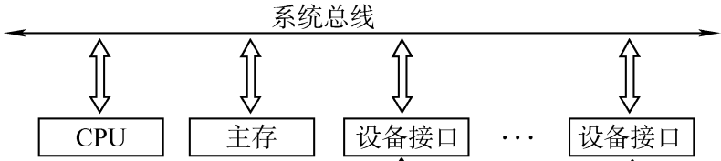
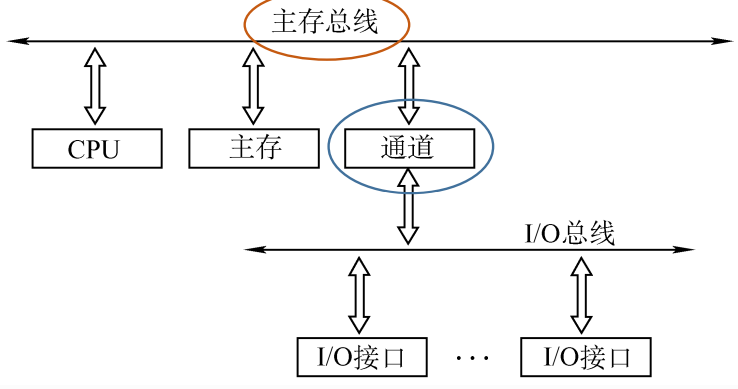

# 6.1 总线概述

## 6.1.1 总线的基本概念

### 1、总线的定义


```admonish
总线是一组能为多个部件<font color=orange>**分时共享**</font>的公共信息传送线路
```


* **分时**：同一时刻只能有<font color=orange>**一个**</font>部件向总线<font color=orange>**发送**</font>消息
* **共享**：同一时间可以有<font color=orange>**多个**</font>设备从总线<font color=orange>**接收**</font>消息

### 2、总线的特性

- 机械特性：尺寸、形状、管脚数、排列顺序
- 电气特性：传输方向和有效的电平范围
- 功能特性：每根传输线的功能（地址、数据、控制）
- 时间特性：信号的时序关系

### 3、总线设备

总线上所连接的各类设备按其<font color=orange>**对总线有无控制功能**</font>分为

- **主设备**：获得总线控制权的设备
- **从设备**：被主设备访问的设备，只能响应从主设备发来的各种总线命令

## 6.1.2 总线的分类

### 1、按照数据传输格式

- **串行总线**：每次传输一个bit，只需要一根数据线，通过<font color=purple>**差模信号**</font>表示0/1
  - 优点：
    - 成本低廉
    - 广泛应用于长距离传输
    - 可以节省布线空间
  - 缺点
    - 在数据发送和接收的时候要进行拆卸和装配，要考虑串行-并行转换的问题
- **并行总线**：一次传输多个bit，使用多根数据线
  - 优点
    - 总线的逻辑时序比较简单
    - 电路实现起来比较容易
  - 缺点
    - 信占用更多的布线空间
    - 远距离传输成本高
    - 多跟信号线存在干扰，速度可能不如串行

### 2、按照总线功能


- **片内总线**：芯片内部的总线，如连接CPU芯片内部的寄存器与寄存器、寄存器与ALU
- **系统总线**：是计算机系统内各功能部件（CPU、主存、I/O接口）之间相互连接的总线
  - 数据总线：位数与机器字长、存储字长相关，<font color=orange>**双向**</font>的
  - 地址总线：位数与主存地址空间大小及设备数量有关，<font color=orange>**单向**</font>的
  - 控制总线：其中的每一根单独的控制线是单向的，功能固定的，仅传输一个信号
- **通信总线**：用于计算机系统之间或计算机系统与其他系统

## 6.1.3 系统总线的结构

### 1、单总线结构



只有一根总线

- 优点
  - 结构简单
  - 成本低
  - 易于接入新的设备。
- 缺点
  - 带宽低
  - 负载重
  - 多个部件只能争用唯一的总线，且不支持并行传送操作
  - 浪费总线速度

### 2、双总线结构



有两条总线，其中<font color=purple>**主存总线**</font>速度较快，连接CPU、主存、通道（与设备的交互）；<font color=purple>**I/O总线**</font>速度较慢，用于I/O设备与通道之间的数据交互

- 优点
  - 将较低速的I/O设备从单总线上分离出来，实现存储器总线和I/0总线分离
  - 主存总线支持突发传送：送出一个地址，收到多个地址连续的数据
- 缺点
  - 需要增加通道等硬件设备

### 3、三总线结构


在双总线结构的基础上，使用<font color=purple>**DMA总线**</font>将高速外设与主存相连

- 优点
  - 提高了I/O设备的性能，使其更快地响应命令
  - 提高系统吞吐量
- 缺点
  - 系统工作效率较低（三根总线同一时间只能有一根总线在工作）

## 6.1.4 总线的性能指标

### 1、总线的传输周期（总线周期）

一次总线操作所需的时间（包括申请阶段、 寻址阶段、传输阶段和结束阶段），通常由若干个<font color=purple>**总线时钟周期**</font>构成（但不一定）

### 2、总线时钟周期

即机器的时钟周期，通过CPU或桥接器（南北桥）发出的时钟信号决定

### 3、总线的工作频率

总线上各种操作的频率，为<font color=orange>**总线周期的倒数**</font>

实际上指一秒内传送几次数据

### 4、总线的时钟频率

即机器的时钟频率，为<font color=orange>**时钟周期的倒数**</font>

实际上指一秒内有多少个时钟周期

### 5、总线宽度（总线位宽）

总线上同时能够并行传输的数据位数，通常是指<font color=orange>**数据总线的根数**</font>

### 6、总线带宽

总线的数据传输率，即单位时间内总线上可传输数据的位数
$$
\begin{align}
总线带宽&=总线工作频率\times总线宽度(\text{bit/s})\\
&=总线工作频率\times(总线宽度/8)(\text{B/s})
\end{align}
$$


```admonish warning
总线带宽是指总线本身所能达到的最高传输速率

在计算实际的<font color=orange>**有效数据**</font>传输率时，要用实际传输的数据量除以耗时（刨除校验位、冗余位等）
```


### 7、总线复用

一种信号线在不同的时间传输不同的信息。

- 优点
  - 可以使用较少的线传输更多的信息，节省了空间和成本
- 缺点
  - 速度会有一定的下降

### 8、信号线数

地址总线、数据总线和控制总线3种总线数的总和
