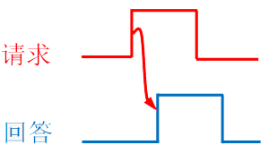
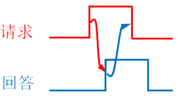
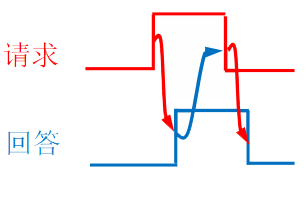
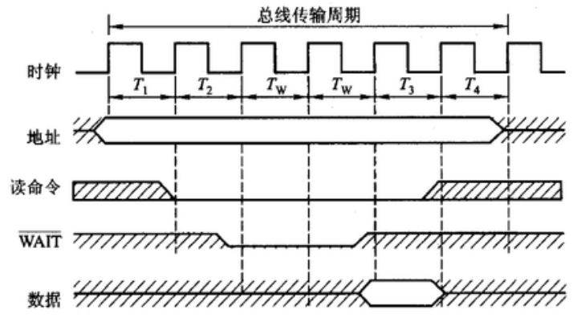

# 6.3 总线操作和定时

## 6.3.1 总线事务

从请求总线到完成总线使用的操作序列称为<font color=purple>**总线事务**</font>

1. **请求阶段**：由需要使用总线的主设备提出申请
2. **仲裁阶段**：经总线仲裁机构决定将下一传输周期的总线使用权授予某一申请者
3. **寻址阶段**：获得使用权的主模块通过总线发出本次要访问的从模块的地址及有关命令，启动参与本次传输的从模块
4. **传输阶段**：主模块和从模块进行数据交换，可单向或双向进行数据传送
5. **结束阶段**：主模块的有关信息均从系统总线上撤除，让出总线使用权


```admonish
**总线定时**：总线在双方交换数据的过程中需要时间上配合关系的控制，这种控制称为总线定时，它的实质是一种协议或规则
```


## 6.3.2 同步定时方式

总线控制器采用一个<font color=orange>**统一的时钟信号**</font>来协调发送和接收双方的传送定时关系

- 由若干个时钟信号组成一个总线周期
- 每一个总线周期中按照固定的顺序进行<font color=orange>**一次**</font>数据传送
- 一个总线的传送周期结束，下一个就立刻继续开始
- 同步通信适用于<font color=orange>**总线长度较短**</font>及总线所接部件的<font color=orange>**存取时间比较接近**</font>的系统


- 优点
  - 传送速度快，具有较高的传输速率
  - 总线控制逻辑简单
- 缺点
  - 主从设备属于强制性同步
  - 不能及时进行数据通信的有效性检验，可靠性较差

## 6.3.3 异步定时方式

在异步定时方式中，没有统一的时钟，也没有固定的时间间隔，完全依靠传送双方相互制约的“握手”信号来实现定时控制

- 主设备提出交换信息的“请求”信号，经接口传送到从设备
- 从设备接到主设备的请求后，通过接口向主设备发出“回答”信号

### 1、不互锁方式



- 主设备的请求信号发出一段时间后自动撤销
- 从设备的应答信号发出一段时间后自动撤销
- 速度最快，可靠性最差

### 2、半互锁方式



- 主设备的请求信号必须收到应答信号才撤销
- 从设备的应答信号自动撤销

### 3、全互锁方式



- 主设备的请求信号在收到应答信号后才撤销
- 从设备的应答信号在请求信号撤销后才能撤销
- 速度最慢，可靠性最强


- 优点
  - 总线周期长度可变
  - 能保证两个工作速度相差很大的部件或设备之间可靠地进行信息交换，自动适应时间的配合
- 缺点
  - 比同步控制方式稍复杂一些
  - 速度比同步定时方式慢

## 6.3.4 半同步通信

在同步定时方式的基础上，增加一个“等待”响应信号



当从设备速度跟不上时，通过等待信号调整一个传输周期内的节拍数

## 6.3.5 分离式通信

在同步通信的基础上，将原来的一整个总线传输周期分为两个子周期

- 子周期1：主设备申请占用总线
  - 从设备的指派
  - 发送命令
- 主设备申请完毕后立即放弃占用总线
- 从设备准备数据信息
- 子周期2：从设备准备完毕后申请占用总线
  - 发送数据

### 特点

- 各模块均有权申请占用总线
- 采用同步方式通信，不等对方回答
- 各模块准备数据时，不占用总线
- 总线利用率提高
