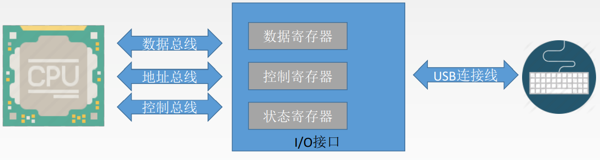
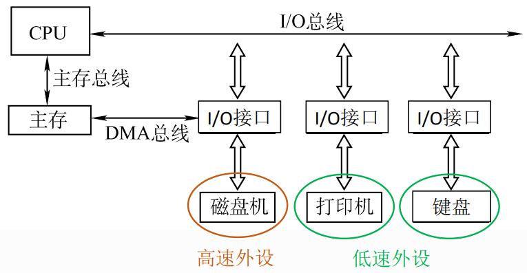
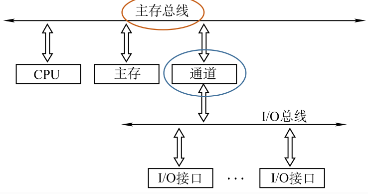

# 7.1 I/O系统的基本概述

## 7.1.1 I/O系统的基本概念

- **外部设备**
  - 输入设备
  - 输出设备
  - 外存设备
- **I/O接口（I/O控制器、设备控制器）**：负责协调主机与外部设备之间的数据传输

## 7.1.2 I/O控制方式

### 1、程序查询方式

- CPU不断轮询检查I/O控制器中的**状态寄存器**
- 检测到状态为已完成
- 从**数据寄存器**取出输入数据

### 2、程序中断方式

- 等待I/O操作时CPU可以先去执行其他程序
- I/O操作完成后I/O控制器向CPU发出中断请求
- CPU响应中断请求，并取走输入数据

### 3、DMA方式

主存与高速I/O设备之间通过DMA总线建立一条直接数据通路

- CPU向DMA 接口发出“读/写”命令
  - 指明主存地址、磁盘地址、读写数据量等参数
  - CPU转而执行其他事务
- DMA控制器自动控制磁盘与主存的数据读写
- 每完成一整块数据读写（如1KB为一整块） ，才向CPU发出一次中断请求

### 4、通道控制方式

将对I/O的控制交由通道来进行

- CPU向通道发出一个I/O指令
- 通道基于这一指令执行一系列的通道程序
- 通道完成所有一系列的通道程序后才向CPU发出中断请求

## 7.1.3 I/O系统的基本组成

### 1、I/O硬件

- 外部设备
- I/O接口
- I/O总线
- ……

### 2、I/O软件

包括驱动程序、用户程序、管理程序、升级补丁等

通常采用**I/O指令**和**通道指令**实现主机和I/O设备的信息交换

- **I/O指令**
  - 操作码：识别I/O指令
  - 命令码：对I/O进行操作（通过驱动程序指明）
  - 设备码：指明操作的设备
- **通道指令**：提前编制好放在主存中

