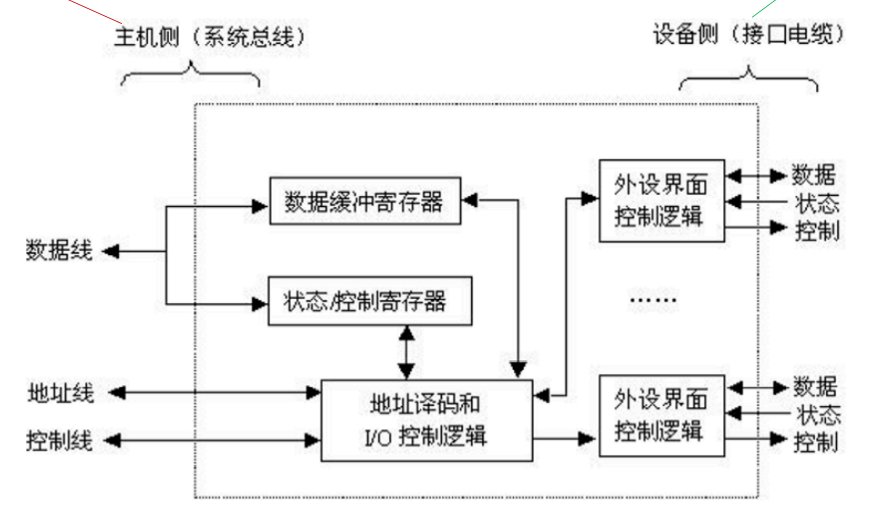
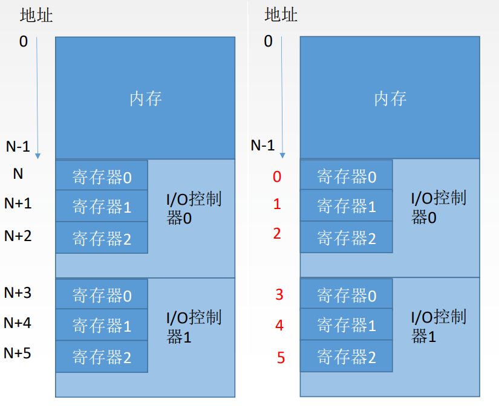

# 7.3 I/O接口


```admonish
I/O硬件分为机械部分和电子部分，其中

- 机械部分是设备本身
- 电子部分（I/O接口）称为**设备控制器**或**I/O适配器**
```


## 7.3.1 I/O接口的功能

- **数据缓冲**：通过<font color=purple>**数据缓冲寄存器**</font>（DBR）达到主机和外设工作速度的匹配
- **错误或状态监测**：通过<font color=purple>**状态寄存器**</font>反馈设备的各种错误、状态信息，供CPU查用
- **控制和定时**：接收从控制总线发来的控制信号、时钟信号
- **数据格式转换**：串-并、并-串等格式转换
- **与主机和设备通信**：实现主机——I/0接口——I/O设备之间的通信

## 7.3.2 I/O接口的基本结构



有的I/O接口可以接多个设备

### 1、I/O接口的工作原理

1. 发命令：发送命令字到<font color=purple>**I/O控制寄存器**</font>，向设备发送命令
2. 读状态：从<font color=purple>**状态寄存器**</font>读取状态字，获得设备或I/O控制器的状态信息
3. 读/写数据：从<font color=purple>**数据缓冲寄存器**</font>发送或读取数据，完成主机与外设的数据交换


```admonish
控制寄存器、状态寄存器在使用时间上是<font color=orange>**错开的**</font>，因此有的I/O接口中可将二者合二为一
```


### 2、I/O接口的内部接口

**内部接口**：内部接口与系统总线相连，实质上是与内存、CPU相连

**外部接口**：外部接口通过接口电缆与外设相连

- **数据线**
  - 读写数据
  - 状态字
  - 命令字（控制字）
  - 中断类型号
- **地址线**
  - I/O端口
- **控制线**
  - 读/写IO端口的信号
  - 中断请求信号

## 7.3.3 I/O端口

I/O端口是指接口电路中可以被CPU直接访问的寄存器

- 不同的寄存器对应着不同的外设
- 实际上不同的端口号就可以访问不同的外设



### 1、统一编址

- 在内存中I/O设备和内存是<font color=orange>**连续的**</font>
- 通过不同的<font color=purple>**地址码**</font>来区分要访问的是内存还是I/O设备
- 使用访存类指令就可以访问I/O端口
- **优点**
  - 不需要专门的输入/输出指令，程序设计灵活性高
  - 端口有较大的编址空间
  - 读写控制逻辑电路简单
- **缺点**
  - 端口占用了主存地址空间
  - 外设寻址时间长

### 2、独立编址

- I/O设备和内存地址是分离的，可能有重复
- 依靠不同的<font color=purple>**指令**</font>区分访问的是I/O设备还是内存
- 只能使用I/O指令访问I/O端口
- **优点**
  - 使用专用I/O指令，程序编制清晰
  - I/O端口地址位数少，地址译码速度快
  - I/O端口的地址不占用主存地址空间
- **缺点**
  - I/O指令类型少，程序设计灵活性差
  - 需要CPU提供存储器读/写、I/O设备读/写两组控制信号，增加了控制逻辑电路的复杂性

## 7.3.4 I/O接口的类型

### 1、按照数据传送方式

- 并行接口
- 串行接口

### 2、按主机访问I/O设备的控制方式可分为

- 程序查询接口
- 中断接口
- DMA接口

### 3、按照是否可编程

- 可编程接口
- 不可编程接口
