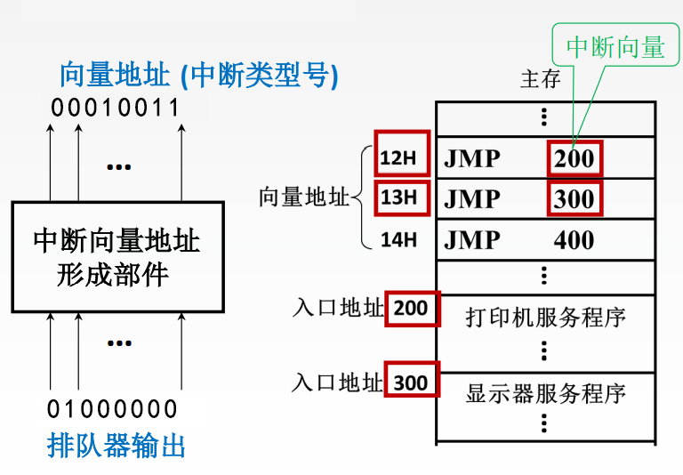
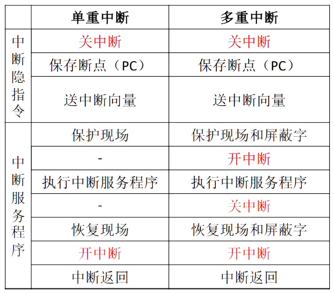
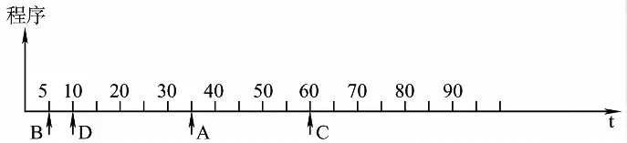
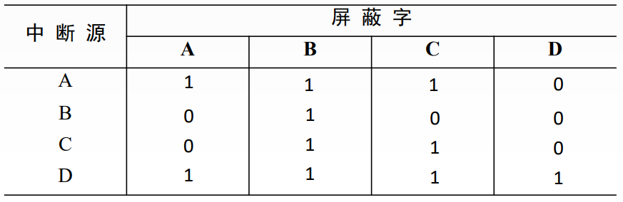
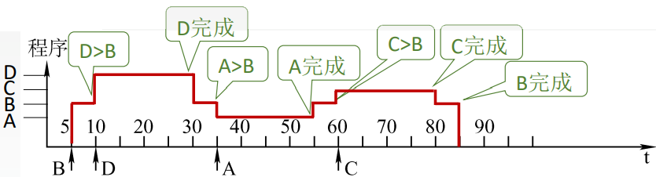
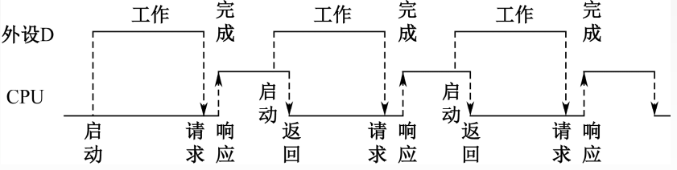
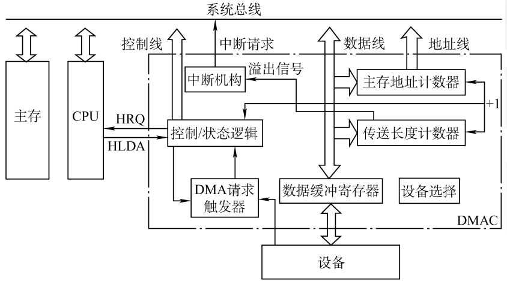
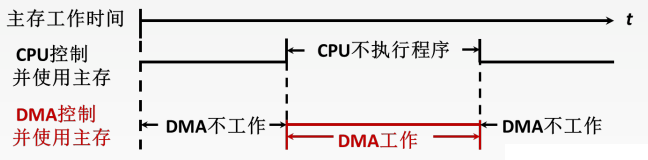
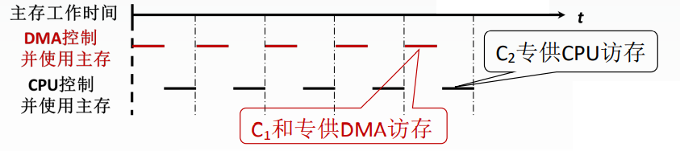
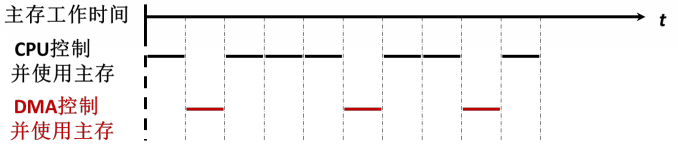

# 7.4 I/O方式

## 7.4.1 程序查询方式


```assembly
IN Rd,Rs #把IO端口Rs的数据输入到CPU寄存器Rd
OUT Rd,Rs #把CPU寄存器Rs的数据输出到IO端口Rd
```


### 1、一次工作的流程

1. CPU执行<font color=orange>**初始化**</font>程序，并预置传送参数
   - 设置计数器
   - 设置数据首地址
2. 向I/O接口发送命令字，<font color=orange>**启动I/O设备**</font>
3. CPU从接口读取设备状态信息
   - CPU不断查询I/O设备状态，直到外设准备就绪
4. 传送一次数据，一般为一个字
5. 修改参数
   - 修改地址
   - 修改计数器
6. 判断传送是否结束，未结束则继续传输

### 2、程序查询方式的优缺点

- 优点
  - 接口设计简单
  - 设备量少
- 缺点
  - CPU在信息传送过程中要花费很多时间用于查询和等待
  - CPU在一段时间内只能和一台外设交换信息
  - 效率低

## 7.4.2 程序中断方式

### 1、中断的基本概念

CPU在每一个指令的末尾会检测是否存在中断

检测到中断时，会进行断点保存，并在中断处理结束后从断点恢复程序

I/O设备的中断属于<font color=purple>**外中断**</font>，且是<font color=purple>**可屏蔽中断**</font>

### 2、中断的工作流程

#### （1）中断请求

中断源向CPU发出中断请求

CPU根据<font color=purple>**中断标志位**</font>判断中断来自谁

#### （2）中断判优

可以通过硬件（排队器）或是软件（查询程序）来实现

一来来说，判优要遵循如下原则

- 硬件故障中断属于最高级，其次是软件中断
- 非屏蔽中断优于可屏蔽中断（对于某些中断，如内中断，即使没有开中断也是能够被响应的）
- DMA请求优于外中断
- 高速设备优于低速设备
- 输入设备优于输出设备
- 实时设备优于普通设备

#### （3）CPU响应中断的条件

- 中断源有中断请求
- 当前CPU处于开中断状态
- 一条指令已经执行完毕

#### （4）中断隐指令

**中断隐指令**：保存原程序的PC值，并让PC指向中断服务程序的第一条指令。是一系列的指令。

1. **关中断**：保证接下来保存断点的操作不被打断
2. **保存断点**：将当前PC的值保存
3. **引出中断服务程序**：将PC的值修改为中断服务程序的入口
   - 硬件向量法
     - 根据排队器的输出确定中断来源
     - 每一个中断对应一个中断向量地址
     - 依据<font color=purple>**向量地址**</font>在主存中找到对应的存储单元
     - 根据存储单元中的<font color=purple>**中断向量**</font>（JUMP）找到中断服务程序入口
   - 软件查询法



#### （5）中断服务程序

1. **保护现场**：保存通用寄存器和状态寄存器的内容
2. **中断服务**
3. **恢复现场**：通过出栈指令或取数指令把之前保存的信息送回寄存器中
4. **中断返回**：弹出栈顶存储的程序断点信息（原PC值），返回到原程序的断点处
5. **开中断**

### 3、多重中断

**单重中断**：执行中断服务程序时不响应新的中断请求

**多重中断**：又称中断嵌套，执行中断服务程序时可响应新的中断请求



#### 中断屏蔽技术

- 每一个中断源对应一个<font color=purple>**屏蔽字**</font>
- 屏蔽字表明处理该中断时屏蔽那些中断
- 屏蔽字是一连串bit，一般1表示屏蔽、0表示允许
- 屏蔽字中1越多，中断优先级越高
- 每个屏蔽字中至少需要一个1（屏蔽自己）


```admonish warning
中断屏蔽字决定中断的处理（完毕）次序

中断的响应次序由中断判优负责
```


```admonish example
例：设某机有4个中断源A、B、C、D，其硬件排队优先次序为A>B>C>D，现要求将中断处理次序改为D>A>C>B。

1）写出每个中断源对应的屏蔽字。

2）按下图所示的时间轴给出的4个中断源的请求时刻，画出CPU执行程序的轨迹。设每个中断源的中断服务程序时间均为20us



（1）优先级高的屏蔽优先级低的+屏蔽自己



- A的屏蔽字：1110
- B的屏蔽字：0100
- C的屏蔽字：0110
- D的屏蔽字：1111

（2）


```


### 4、程序中断方式


```admonish example
例：假定CPU主频为50MHz，CPI为4。设备D采用异步串行通信方式向主机传送7位ASCII字符，通信规程中有1位 奇校验位和1位停止位，从D接收启动命令到字符送入I/O端口需要0.5ms。设备D采用中断方式进行输入/输出，示意图如下



I/O端口每收到一个字符申请一次中断，中断响应需10个时钟周期，中断服务程序共有20条指令，其中第15条指令启动D工作。

（1）若CPU需从D读取1000个字符，则完成这一任务所需时间大约是多少个时钟周期？

（2）CPU用于完成这一任务的时间大约是多少个时钟周期？

（3）在中断响应阶段CPU进行了哪些操作？

解：（1）

主频为50MHz，则时钟周期=1/50MHz=20ns

从D启动到字符送入I/O端口需要的时钟周期=0.5ms/20ns=25000

传送一个字符需要的时钟周期=$25000+10+15\times4=25070$（CPI：每条指令包含的时钟周期）

传送1000个字符需要的时钟周期=$25070\times1000=25070000(+5\times4)$（是否加上最后的中断处理都行）

（2）

实际上CPU相关的时钟周期就是处理中断程序的部分，故

$1000\times(10+20\times4)=9\times10^{4}$

（3）

即中断隐指令的内容：

- 关中断
- 保存断点
- 引出中断程序
```


## 7.4.3 DMA方式


```admonish
CPU在每个存储周期结束后检查是否有DMA请求

CPU在每个指令周期结束后检查是否有中断请求
```


### 1、DMA控制器的组成



- **数据缓冲寄存器DR**：用于暂存每次传送的数据
- **主存地址计数器AR**：存放要交 换数据的主存地址
- **传送长度计数器WC**：用来记录传送数据的长度
  - 计数溢出时，数据即传送完毕，自动发<font color=purple>**中断请求信号**</font>
- **DMA请求触发器**：每当I/O<font color=orange>**设备准备好数据**</font>后给出一个控制信号， 使DMA请求触发器置位
- **控制/状态逻辑**：由控制和时序电路及状态标志组成
  - 指定传送方向
  - 修改传送参数（即主存地址和传送长度计数器）
  - 对DMA请求信号和CPU响应信号进行协调和同步
- **中断机构**：当一个数据块传送完毕后触发中断机构，向CPU提出中断请求

### 2、DMA传送过程

1. **预处理**
   - 主存起始地址→AR
   - I/O设备地址→DAR（也是一个寄存器）
   - 传送数据个数→WC
   - 起送I/O设备
2. **数据传送**
   1. 设备将数据写入DR
   2. DR写满后设备向DMA请求触发器发出<font color=purple>**DMA请求**</font>
   3. <font color=purple>**控制/状态逻辑**</font>检测到DMA请求后向CPU申请总线使用权
   4. CPU将总线控制权交给DMA控制器
   5. 根据AR中的地址将DR中的数据写入主存
   6. 修改AR和WC的值
   7. 循环以上过程
3. **后处理**
   1. 当数据传送完毕，WC溢出，产生中断信号
   2. CPU进行相应的中断服务程序

### 3、DMA传送方式

在采用三总线结构的计算机中，由于DMA和CPU访问主存不使用同一条总线，因此存在CPU和DMA控制器同时访问主存的情况，为避免冲突，一般采取以下三种逻辑：

#### （1）停止CPU访存

DMA访问主存时CPU不使用主存



- 优点
  - 控制简单
- 缺点
  - 未充分发挥 CPU 对主存的利用率

#### （2）DMA与CPU交替访存

固定的将时钟周期分为两份，一份CPU使用、一份DMA使用



- 优点
  - 不需要总线使用权的申请、建立和归还过程
- 缺点
  - 硬件逻辑更为复杂
  - 存在资源浪费（DMA不一定一直需要访存）

#### （3）周期挪用

具体情况具体分析



当DMA访问主存时：

- CPU没有访存：直接使用
- CPU正在访存：等待访存周期结束
- CPU与DMA同时申请访存：I/O访存优先

### 4、DMA方式的特点

- 它使主存与CPU的固定联系脱钩，<font color=orange>**主存既可被CPU 访问，又可被外设访问**</font>
- 在数据块传送时，主存地址的确定、传送数据的计数等都由硬件电路直接实现
- 主存中要开辟专用缓冲区，及时供给和接收外设的数据
- DMA传送速度快，<font color=orange>**CPU和外设并行工作**</font>，提高了系统效率
- DMA在传送开始前要通过程序进行预处理，结束后要通过中断方式进行后处理

