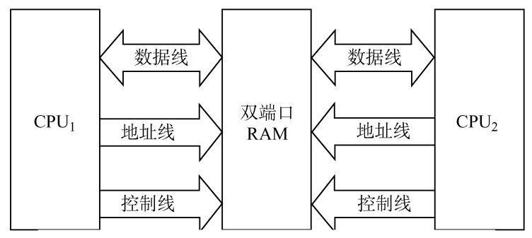
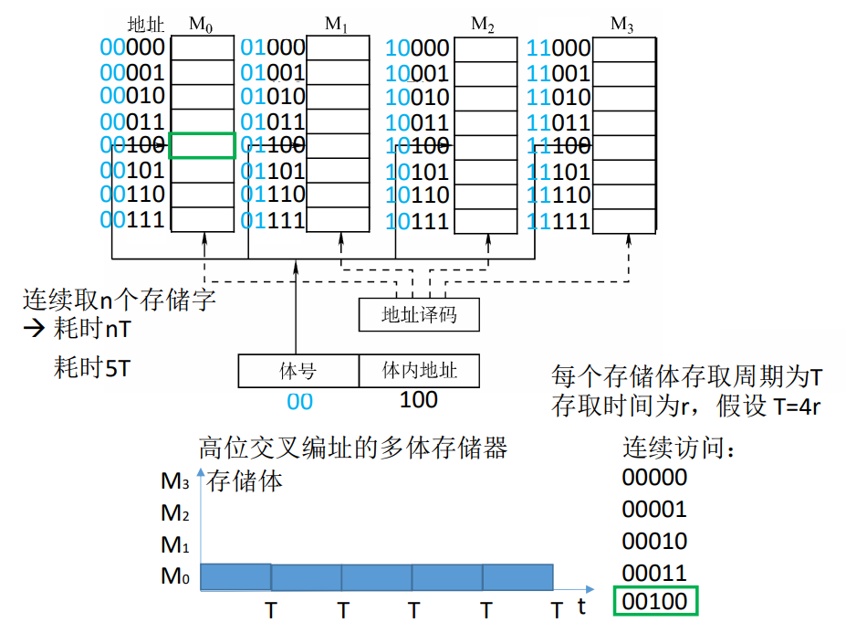
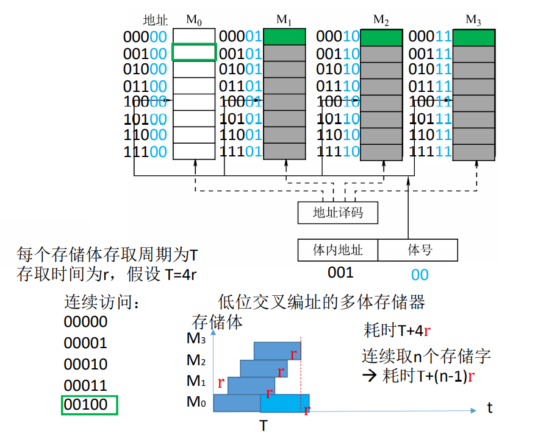

# 3.5 双端口RAM和多模块存储器

为了解决存取周期的**恢复时间**内无法读写的问题，可以采用空间和时间上的并行两种思路来解决问题。

## 3.5.1 双端口RAM

拥有两个端口，可以同时访问不同的地址单元。



当连个端口访问同一个地址单元时：

* 两个端口不同时对同一地址单元存取数据 ✔
* 两个端口同时对同一地址单元读出数据 ✔
* 两个端口同时对同一地址单元写入数据 ❌
* 两个端口同时对同一地址单元，一个写入数据，另一个读出数据 ❌

可以通过**忙信号**解决这一问题，当有忙信号时，暂时关闭其中一个端口。

## 3.5.2 多模块存储器

### 1、单体多字存储器

* 每个存储单元内存储m个字
* 总线宽度为m个字
* 一次并行读/写m个字

#### 优缺点

* 优点
  * 提高了带宽，增加了读写速度
* 缺点
  * 指令和数据在主存内必须是**连续存放**的
  * 对转移指令、不连续操作数据效果不明显

### 2、多体并行存储器

有多个存储模块，每个存储模块有相同的容量和存取速度；单独的读写控制器、地址寄存器和数据寄存器。

能并行工作，也能交叉工作。

#### （1）高位交叉编制



连续访问时还是在一个模块内进行，实际上仅仅实现了**扩容**，**不能提高访问速度**。

高位交叉编制**不满足**程序的<font color=purple>**局部性原理**</font>。

#### （2）低位交叉编制



当连续访问时，在多个模块间切换，提高了吞吐效率。

低位交叉编制**满足**程序的<font color=purple>**局部性原理**</font>。


```admonish example
例：模块数m=4，存储周期为T，字长w，数据总线宽度为W，总线传输周期为r，连续存储n个字，求交叉存储器的带宽。

* 连续存储n个字耗时： $T +(n-1)\times r$ 前提： $m \geq \frac{T}{r}$ 
* 带宽： $\frac{n \times w}{T + (n-1)r}$ 
* n较大时，带宽趋近于 $\frac{w}{r}$ 
* 单个存储体的带宽： $\frac{w}{T}$ 
```

