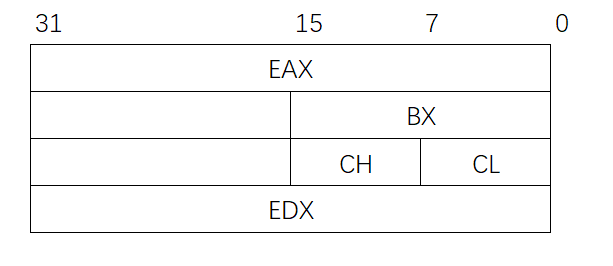

# 4.4 程序的机器级代码

## 4.4.1 x86汇编指令

### 一、指令格式

> 指令 目的操作数 源操作数

mov <font color=blue>eax</font>, <font color=blue>ebx</font>

将<font color=blue>寄存器ebx</font>的值复制到<font color=blue>寄存器eax</font>


mov <font color=blue>eax</font>, <font color=purple>5</font>

将<font color=purple>立即数5</font>的值复制到<font color=blue>寄存器eax</font>


mov <font color=blue>eax</font>, <font color=red>dword ptr</font> <font color=green>\[af996h]</font>

将<font color=green>内存地址\[af996h]</font>所指的<font color=red>32bit</font>值复制到<font color=blue>寄存器eax</font>


mov <font color=red>byte ptr</font> <font color=green>\[af996h]</font>, <font color=purple>5</font>

将<font color=purple>立即数5</font>的值复制到<font color=green>内存地址\[af996h]</font>所指的<font color=red>一字节</font>中


```admonish
指明内存读写的长度

- **dword ptr**：双字，32bit
- **word ptr**：单字，16bit
- **byte ptr**：字节，8bit

主存没有指令长度<font color=orange>**默认32bit**</font>
```


### 二、常用寄存器

E：(Extended)，32bit

* **通用寄存器**（X：未知）
  * EAX：作为累加器
  * EBX：作为基地址寄存器
  * ECX：作为循环计数器
  * EDX：作为数据寄存器


```admonish example
通用寄存器可以继续细分为16bit和8bit的


```


* **变址寄存器**（I：Index）
  * ESI：（Source）源操作数
  * EDI：（Destination）目的操作数
* **堆栈寄存器**
  * EBP：（Base Pointer）堆栈基指针
  * ESP：（Stack Pointer）堆栈顶指针


### 三、AT&T格式

* 源操作数和目的操作数顺序与Intel格式相反
* (……)：主存地址，可以存在加减法
* %：寄存器前缀
* $：立即数前缀
* 读写长度
  * MOVB \$5, (af996h)：MOV byte ptr [af996h],  5
  * MOVW \$5, (af996h)：MOV word ptr [af996h],  5
  * MOVL \$5, (af996h)：MOV dword ptr [af996h],  5
* MOV 8(%EDX, %EAX, 2)：MOV \[EDX+EAX\*2+8]
  * 偏移量为8
  * 基址寄存器EDX
  * 变址寄存器EAX
  * 比例因子2

## 4.4.2 常用指令

### 一、算术运算


```assembly
ADD d,s		#(d)+(s)→(d)
SUB d,s 	#(d)-(s)→(d)

MUL d,s 	#无符号数乘法
IMUL d,s	#有符号数乘法

DIV s		#无符号数除法，被除数隐式存放在EDX:EAX中(位扩展到64位)
IDIV s		#有符号数除法，(接上)商存入EAX，余数存入EDX

NEG d		#取负数

INC d		#自增++
DEC d		#自减--
```


### 二、逻辑运算指令

```assembly
AND d,s		#与
OR d,s		#或
NOT d		#非
XOR d,s		#异或

SHL d,s		#左移
SHR d,s		#右移
```


### 三、控制流指令

```assembly
JUMP <addr>		#无条件转移指令
CMP a,b			#比较a和b两个数

#在比较之后，可以使用以下指令
JE <addr>		#a==b 则跳转
JE <addr>		#a!=b 则跳转
JE <addr>		#a>b 则跳转
JE <addr>		#a>=b 则跳转
JE <addr>		#a<b 则跳转
JE <addr>		#a<=b 则跳转

LOOP <tag>		##自动ecx--,ecx!=0,则跳转到tag
```


## 4.4.3 具体实现

### 一、条件跳转

源代码

```java
int a = 7;
int b=6;

if (a>b){
    c=a;
} else {
    c=b;
}
```

利用转移指令实现：

```assembly
mov eax,7
mov abx,6
cmp eax,ebx
jg NEXT
mov ecx,ebx
jmp END
NEXT:
mov ecx,eax
END:
```


### 二、循环语句

源代码

```java
int result = 0;
for (int i=1; i<=100; i++){
    result+=1;
}
```

使用转移指令实现

```assembly
#循环初始化
mov eax,0
mov edx,1
#检测是否直接跳出循环
cmp edx,100
jg L2
#循环主体
L1:
add eax,edx
inc edx
#是否继续循环
cmp edx,100
jle L1
#跳出循环
L2:
```

使用loop指令实现

```assembly
mov eax,0
mov edx,1
mov ecx,100		#循环100次
Looptop:
add eax,edx
inc edx
loop Looptop
```

