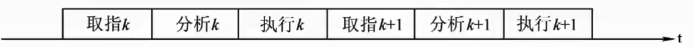
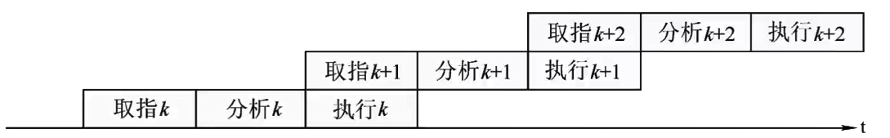
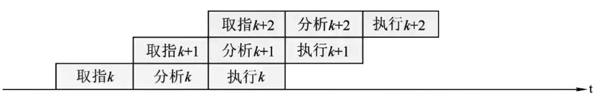
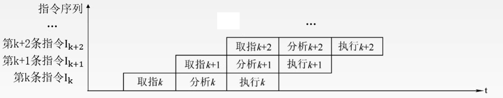
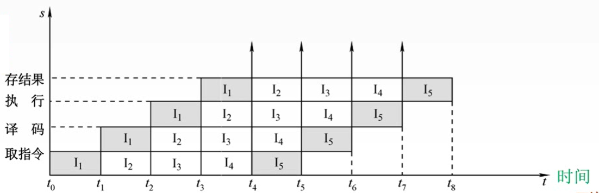
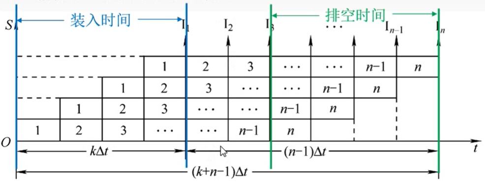
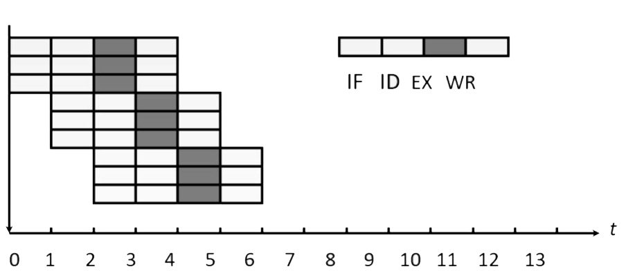
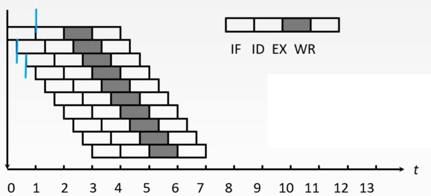
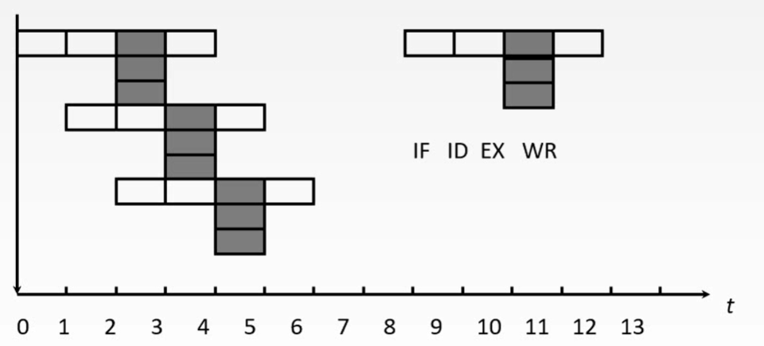
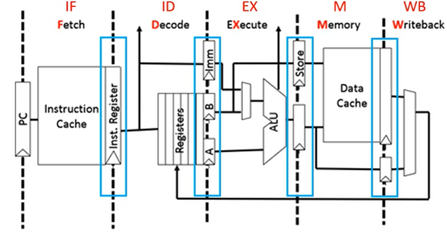

# 5.5 指令流水线

## 5.5.1 流水线的概念

### 1、指令流水的定义

将指令执行过程划分为<font color=orange>**不同的阶段**</font>，占用<font color=orange>**不同的资源**</font>，使得多条指令<font color=orange>**同时执行**</font>。

#### （1）顺序执行方式



时间：$$T=3nt$$

传统冯诺依曼结构，又称<font color=purple>**串行执行方式**</font>。

- 优点
  - 控制简单，硬件代价小
- 缺点
  - 执行指令的速度较慢，
  - 各功能部件的利用率很低

#### （2）一次重叠执行方式



时间：$T=3t+(n-1)\times 2t=(1+2n)t$

- 优点
  - 程序的执行时间缩短了1/3
  - 各功能部件的利用率明显提高。
- 缺点
  - 需要付出硬件上较大开销的代价
  - 控制过程比顺序执行复杂

#### （3）二次重叠执行方式



时间：$T=3t+(n-1)t=(2+n)t$

时间更短


```admonish warning
实际使用中也可以分成更多段，如4段甚至5段
```


### 2、流水线的表示方法

#### （1）指令执行过程图



主要用于分析指令执行过程以及影响流水线的因素

#### （2）时空图



主要用于分析流水线的性能


## 5.5.2 流水线的性能指标

### 1、吞吐率

吞吐率是指在单位时间内流水线所**完成的任务数量**，或是输出结果的数量

- 吞吐率：$\text{TP}=\frac{n}{T_{k}}$
  - $n$：任务数量
  - $T_{k}$：完成n个任务的总时间
- 理想状态下的流水线时空图



- 一条指令的执行分为k个阶段
- 每个阶段耗时$\Delta t$

$$
\begin{align}
&T_{k} = [k+(n-1)]\Delta t\\
&\text{TP}=\frac{n}{k+n-1}\Delta t\\
&\text{TP}_{max}=\lim_{n \to \infty}\text{TP} = \frac{1}{\Delta t}
\end{align}
$$

### 2、加速比

**不使用**流水线所用的时间与**使用**流水线所用的时间之比。
$$
\text{S}_{max} = \lim_{n\to \infty}\text{S}=k
$$


### 3、效率

流水线的<font color=orange>**设备利用率**</font>称为流水线的效率。
$$
\begin{align}
&流水线效率 =\frac{任务占用了的时空区域}{总的时空区域}\\
\ \\
&\text{E}_{max} = \lim_{n\to \infty}\text{E}=1
\end{align}
$$

## 5.5.3 影响流水线的因素

### 1、结构相关（资源冲突）

**结构相关**：由于多条指令在同一时刻<font color=orange>**争用同一资源**</font>（主存、寄存器等）而形成的冲突

#### 解决方案

- 后一相关指令暂停一周期
- **资源重复配置**：数据存储器+指令存储器分开存储

### 2、数据相关（数据冲突）

在一个程序中，存在必须<font color=orange>**等待**</font>前一条指令执行完才能执行后一条指令的情况，则这两条指令即为<font color=purple>**数据相关**</font>。

#### 解决方案

- 把遇到数据相关的指令及其后续指令都暂停一至几个时钟周期，直到数据相关问题消失后再继续执行
  - 硬件阻塞（stall）
  - 软件插入<font color=purple>**空操作NOP**</font>
- **数据旁路**技术：通过数据旁路直接将ALU的运算结果接回为下一条操作的输入
- **编译优化**：通过编译器调整指令顺序来解决数据相关

### 3、控制相关（控制冲突）

当流水线遇到<font color=purple>**转移指令**</font>和其他<font color=orange>**改变PC值**</font>的指令而造成断流时，会引起控制相关

#### 解决方案

- 转移指令分支预测
  - 简单预测
  - 动态预测
- 预取转移成功和不成功两个控制流方向上的目标指令
- 加快和提前形成条件码
- 提高转移方向的猜准率
- 在分支指令插入空操作

## 5.5.4 流水线的分类

### 1、根据流水线使用的级别

- **部件功能级流水线**：将复杂的<font color=purple>**算术逻辑运算**</font>组成流水线工作方式
- **处理机级流水线**：把一条<font color=purple>**指令**</font>解释过程分成多个子过程
- **处理机间级流水线**：协调不同处理机间的不同任务

### 2、根据流水线可以完成的功能

- **单功能流水线**：只能实现一种固定的专门功能
- **多功能流水线**：通过各段间的不同连接方式可以同时或不同时地实现多种功能

### 3、根据同一时间内各段之间的连接方式

- **静态流水线**：在同一时间内，流水线的各段只能按同一种功能的连接方式工作
- **动态流水线**：在同一时间内，当某些段正在实现某种运算时，另一些段可以进行另一种运算

### 4、根据各个功能段之间是否有反馈信号

- **线性流水线**：从输入到输出，每个功能段<font color=orange>**只允许经过一次**</font>， 不存在反馈回路
- **非线性流水线**：存在反馈回路，从输入到输出过程中，某些功能段将数次通过流水线，这种流水线适合进行线性递归的运算

## 5.5.5 流水线的多发技术

### 1、超标量技术



每个时钟周期内可<font color=orange>**并发多条独立指令**</font>，通过编译优化技术，把可并行执行的指令搭配起来。属于<font color=orange>**空分复用技术**</font>。

- 要配置多个功能部件
- 不能调整指令的执行顺序
- 如上图中，称为处理机的<font color=orange>**度为3**</font>
  - 传统指令流水线度为1


### 2、超流水技术



在一个时钟周期内<font color=orange>**再分段**</font>，一个功能部件使用多次。属于<font color=orange>**时分复用技术**</font>。

- 流水线速度为原来的多倍
- 不能调整指令的执行顺序
- 靠编译程序解决优化问题

### 3、超长指令字



由编译程序挖掘出指令间潜在的并行性，将多条能并行操作的指令组合成一条

- 具有多个操作码字段的超长指令字（可达几百位）

## 5.5.6 5段式指令流水线



- **取指IF**（instruction fetch）：将指令从Cache中取出，放入寄存器
- **指令译码ID**（instruction decode）
  - 指令译码
  - 将操作数从通用寄存器中取出，放入锁存器
- **执行EX**（execute）
- **访存M**（memory）
- **写回WB**（write back）：将运算结果写回主存/寄存器


```admonish warning
指令和数据分开存储在两个Cache中，可以使得取指与访存同时执行

Cache未命中会造成流水线断流

RISC中只有LOAD和STORE指令才能访问主存
```


令每个阶段时间耗时一样，取最长耗时为准

**缓冲寄存器（锁存器）**：位于流水线每一段之后，其作用是<font color=orange>**保存本流水段的执行结果**</font>，提供给下一流水段使用

### 1、运算类指令

```assembly
add Rs,Rd
```


- IF：根据PC从指令Cache取指令到IF段锁存
- ID：取出操作数到ID段锁存
- EX：运算，将结果存入EX段锁存
- M：<font color=red>空段</font>
- WB：将运算结果写回指定寄存器

### 2、LOAD指令

```assembly
LOAD Rd,114(Rs)
```

- IF：根据PC从指令Cache取指令到IF段锁存
- ID
  - 将<font color=purple>**基址寄存器**</font>的值存到段锁存器中
  - 将<font color=purple>**偏移量**</font>的值（立即数）存到Imm中
- EX：运算，得到有效地址，将结果存入EX段锁存
- M：根据有效地址从Cache中取数，放入M段锁存器中
- WB：将取出的数写回指定寄存器

### 3、STORE指令

```assembly
STORE Rs,114(Rd)
```


- IF：根据PC从指令Cache取指令到IF段锁存
- ID
  - 将<font color=purple>**基址寄存器**</font>的值存到ID段锁存器中
  - 将<font color=purple>**偏移量**</font>的值（立即数）存到Imm中
  - 将要存的数放到ID段锁存器中
- EX：
  - 运算，得到有效地址，将结果存入EX段锁存
  - 将要存的数从ID段锁存器转移到EX段锁存
- M：将数据写入Cache
- WB：<font color=red>空段</font>

### 4、转移类指令

```assembly
beq Rs,Rt,#114 //若(Rs)==(Rt),则(PC)+指令字长+(偏移量X指令字长)→PC
```

- IF：根据PC从指令Cache取指令到IF段锁存
- ID
  - 将要进行比较的两个数存到段锁存器中
  - 将<font color=purple>**偏移量**</font>的值（立即数）存到Imm中
- EX：运算，比较两个数
- M：将目标PC的值写回PC
- WB：<font color=red>空段</font>

### 5、无条件转移指令

```assembly
jmp #114
```

- IF：根据PC从指令Cache取指令到IF段锁存
- ID：将<font color=purple>**偏移量**</font>的值（立即数）存到Imm中
- EX：将目标PC的值写回PC
- M：<font color=red>空段</font>
- WB：<font color=red>空段</font>


```admonish warning
修改PC的硬件实际上是与5段式流水线的硬件独立的

需要尽早的完成对PC的修改
```
